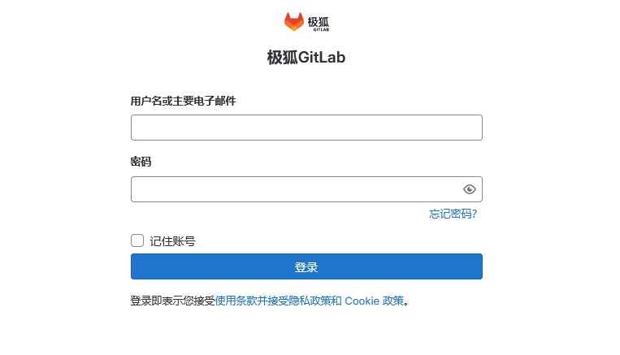

@[toc]
> **Gitlab官网：**  [https://about.gitlab.com/](https://about.gitlab.com/)
> **Gitlab安装：**   [https://gitlab.cn/install/](https://gitlab.cn/install/)

<br/>

# 1. 创建GitLab目录
- 为了数据的操作安全，建议创建`data`、`config`、`logs`三个数据卷。
```shell
mkdir -p /data/gitlab/config /data/gitlab/logs /data/gitlab/data
```


<br/>


# 2. 下载GitLab镜像
```shell
docker pull registry.gitlab.cn/omnibus/gitlab-jh:latest       #官方镜像 (文件较大3G+)    
```


<br/>


# 3. 运行GitLab容器
- 主要暴露`HTTP(80)、SSL(443)、SSH(22)`三个端口。
```shell
# 192.168.xxx.xxx为是宿主机IP
docker run \
--detach \
--hostname 192.168.xxx.xxx \
--publish 9443:443 \
--publish 9080:80 \
--publish 9022:22 \
--name gitlab \
--restart always \
--volume /data/gitlab/config:/etc/gitlab \
--volume /data/gitlab/logs:/var/log/gitlab \
--volume /data/gitlab/data:/var/opt/gitlab \
registry.gitlab.cn/omnibus/gitlab-jh:latest

# 查看相关日志
docker logs gitlab
```


<br/>


# 4. 配置GitLab服务
- 由于`22端口已经被宿主机占用`，所以我们必须另指定一个端口(`9022`)映射到gitlab上。
```shell
vim /data/gitlab/config/gitlab.rb
#************************gitlab配置************************
# 配置http协议
external_url 'http://192.168.xxx.xxx'    # 宿主机IP

# 配置ssh协议
gitlab_rails['gitlab_ssh_host'] = '192.168.xxx.xxx'
gitlab_rails['gitlab_shell_ssh_port'] = 9022
gitlab_rails['time_zone'] = 'Asia/Shanghai'
#*************************************************************
```
```shell
# 重启GitLab
docker restart gitlab
```
**查看root默认密码：**

```shell
docker exec -it gitlab grep 'Password:' /etc/gitlab/initial_root_password
```


<br/>

# 5. 初始化root账号
浏览器访问 http://192.168.xxx.xxx:9080/ ，账号：`root`，密码见上一步操作。



Gitlab服务初始化较慢，遇到`502`错误或页面无法打开，请继续刷新等待...


<br/>


## 配置Nginx

```shell
# 查看Gotlab自带的Nginx版本
docker exec -ti gitlab /opt/gitlab/embedded/sbin/nginx -v
```

```shell
vim /data/gitlab/config/gitlab.rb

external_url 'http://hub.mafool.com'
nginx['listen_port'] = 9080

docker restart gitlab
```


```nginx
server {
    listen 80;
    server_name hub.mafool.com;
 
    location / {
            # push文件大小 会失败，根据情况调整
            client_max_body_size 50m;
            proxy_redirect off;
            #以下确保 gitlab中项目的 url 是域名而不是 http://git，不可缺少
            proxy_set_header Host $host;
            proxy_set_header X-Real-IP $remote_addr;
            proxy_set_header X-Forwarded-For $proxy_add_x_forwarded_for;
            # 反向代理到 gitlab 内置的 nginx ，192.168.100.120为gitlab内容nginx服务IP地址
            proxy_pass http://localhost:9080;
            #index index.html index.htm;
        }
}
```


## 备份还原


## 配置邮件


> 参考：
> [推荐]https://blog.csdn.net/michael_base/article/details/77966647
> https://blog.csdn.net/u014258541/article/details/79224492/
>
> https://blog.csdn.net/cen50958/article/details/93352349
>
> [CI/CD服务]：https://github.com/bravist/gitlab-ci-docker
>
> https://blog.csdn.net/sunyuhua_keyboard/article/details/124901471
>
> https://blog.csdn.net/jiangxiaoyi_07/article/details/131644370


