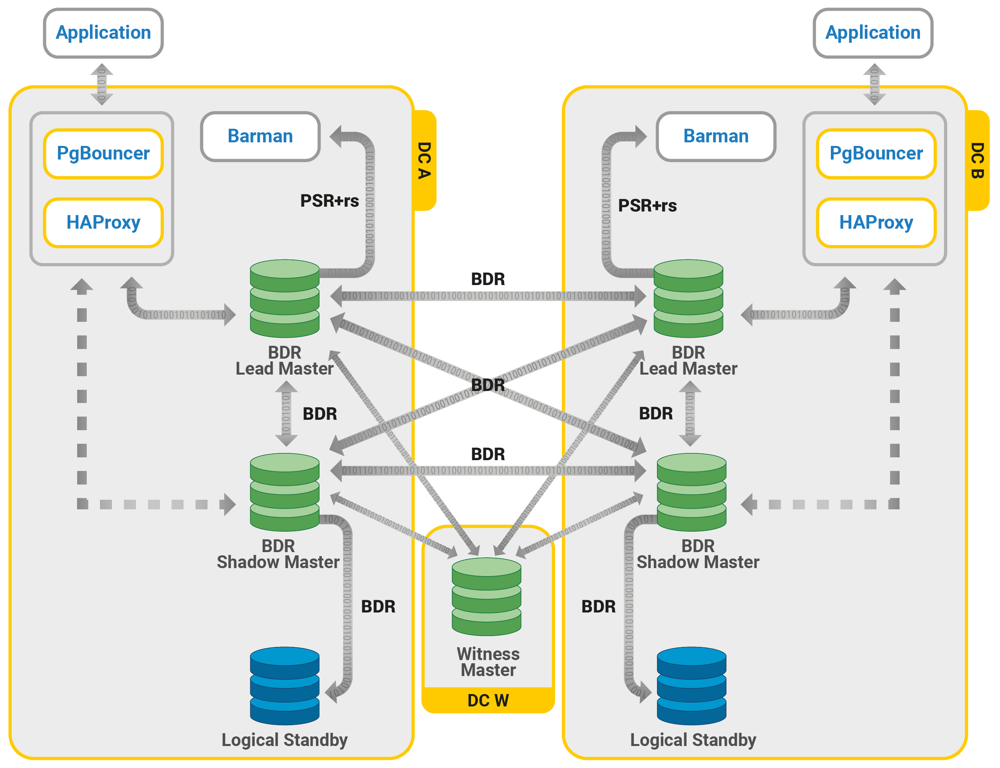

[TOC]

See the source image



## 安装HProxy
https://blog.csdn.net/qq_33158376/article/details/87864400
https://www.cnblogs.com/happy1983/p/9265358.html


## 集群管理工具
### 1.构建镜像
可从[我们的Github存储库](https://github.com/severalnines/docker)中获得Dockerfile 。您可以通过克隆存储库来手动构建它：
```shell
$ git clone https://github.com/severalnines/docker
$ cd docker/
$ docker build -t severalnines/clustercontrol .
```
### 2.运行容器
请参阅[Docker Hub页面](https://registry.hub.docker.com/u/severalnines/clustercontrol/)以获取最新说明。使用命令下载图像：`docker pull`
```shell
$ docker pull severalnines/clustercontrol
```
使用以下命令运行：
```shell
$ docker run -d --name clustercontrol -p 5000:80 severalnines/clustercontrol
```
启动后，可以从访问ClusterControl 。您应该看到欢迎页面以创建默认的管理员用户。使用您的电子邮件地址并为该用户指定密码。默认情况下，MySQL用户root和cmon将分别使用'password'和'cmon'作为默认密码。您可以使用-e标志覆盖此值，如下所示：`http://Docker_host:5000/clustercontrol`
```shell
$ docker run -d --name clustercontrol -e CMON_PASSWORD=MyCM0n22 -e MYSQL_ROOT_PASSWORD=SuP3rMan -p 5000:80 severalnines/clustercontrol
```
（可选）您可以通过附加以下转发，使用-p映射HTTPS端口：
```shell
$ docker run -d --name clustercontrol -p 5000:80 -p 5443:443 severalnines/clustercontrol
```
使用ps命令验证容器是否正在运行：
```shell
$ docker ps
```
有关使用Docker映像进行部署的更多示例，请参阅[Docker](http://www.severalnines.com/blog/clustercontrol-docker)上的[ClusterControl](http://www.severalnines.com/blog/clustercontrol-docker)和[Docker映像Github页面](https://github.com/severalnines/docker/)。有关配置选项的更多信息，请参阅[ClusterControl的Docker Hub](https://registry.hub.docker.com/u/severalnines/clustercontrol/)页面。

### 3. 分发密钥
一旦ClusterControl启动并运行，您就可以导入现有集群或部署新的数据库集群，然后从一个位置开始管理它们。确保从ClusterControl节点到数据库节点配置了无密码的SSH。
1.在ClusterControl节点上生成SSH密钥：
```sh
$ docker exec -ti clustercontrol /bin/bash

# docker会自动生成密钥对，该步骤可省略
$ ssh-keygen -t rsa # press Enter on all prompts
```
2.设置无密码SSH到ClusterControl和数据库节点：
```shell
$ ssh-copy-id -i ~/.ssh/id_rsa {os_user}@{IP address/hostname}
```
对要管理的所有数据库主机（包括ClusterControl节点本身）重复步骤2。


## PGpool
https://www.jianshu.com/p/12bc931ebba3


## 参考链接
https://www.cnblogs.com/rongfengliang/p/10449224.html
