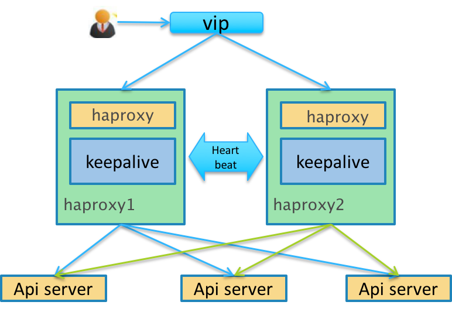

[TOC]

## Keepalived概述
keepalived是集群管理中保证集群高可用的一个服务软件，其功能类似于heartbeat，用来防止单点故障。

keepalived是以VRRP协议为实现基础的，VRRP全称Virtual Router Redundancy Protocol，即虚拟路由冗余协议。

> 虚拟路由冗余协议，可以认为是实现路由器高可用的协议，即将N台提供相同功能的路由器组成一个路由器组，这个组里面有一个master和多个backup，master上面有一个对外提供服务的vip（该路由器所在局域网内其他机器的默认路由为该vip），master会发组播，当backup收不到vrrp包时就认为master宕掉了，这时就需要根据VRRP的优先级来选举一个backup当master。这样的话就可以保证路由器的高可用了。




## 安装Keepalived


```shell
# 下载解压
KA_VERSION=2.0.8
wget http://www.keepalived.org/software/keepalived-$KA_VERSION.tar.gz
tar zxvf keepalived-$KA_VERSION.tar.gz && cd keepalived-$KA_VERSION

# 编译安装
./configure --prefix=/usr/local/keepalived
make
make install
```
```shell
# 拷贝配置文件和应用
mkdir -p /etc/keepalived
cp /usr/local/keepalived/sbin/keepalived /usr/sbin/
cp /usr/local/keepalived/etc/sysconfig/keepalived /etc/sysconfig/
cp /usr/local/keepalived/etc/keepalived/keepalived.conf /etc/keepalived/

# 添加系统启动项(在源码目录操作)
cp ./keepalived/etc/init.d/keepalived /etc/rc.d/init.d/

# 启动服务
service keepalived start   #启动服务
service keepalived stop    #停止服务
service keepalived status  #查看服务状态

```


## 配置Keepalived
```shell
vim /etc/keepalived/keepalived.conf 
```
```shell
# 全局定义块
global_defs {
   # 邮件通知配置，用于服务有故障时发送邮件报警，可选项
   notification_email {
     541223550@qq.com
   }
   # 通知邮件从哪里发出
   notification_email_from root@localhost
   # 通知邮件的smtp地址
   smtp_server 127.0.0.1
   # 连接smtp服务器的超时时间
   smtp_connect_timeout 30
   # 标识本节点的字条串，通常为hostname，但不一定非得是hostname。故障发生时，邮件通知会用到
   router_id LVS_DEVEL
}
# 做健康检查的脚本配置，当时检查失败时会将vrrp_instance的priority减少相应的值
vrrp_script chk_haproxy {
    # 待执行脚本
    script "/etc/keepalived/chk_nginx.sh"
    # 执行间隔
    interval 2
    # 控制priority增减
    weight 2
}
# VRRP实例定义块
vrrp_instance VI_1 {
    # 标识当前节点的状态，可以是MASTER或BACKUP，当其他节点keepalived启动时会将priority比较大的节点选举为MASTER
    state MASTER
    # 节点固有IP（非VIP）的网卡，用来发VRRP包
    interface ens192
    # 取值在0-255之间，用来区分多个instance的VRRP组播。同一网段中virtual_router_id的值不能重复，否则会出错
    virtual_router_id 100
    # 用来选举master的，要成为master，那么这个选项的值最好高于其他机器50个点，该项取值范围是[1-254]（在此范围之外会被识别成默认值100）
    priority 200
    # 发VRRP包的时间间隔，即多久进行一次master选举（可以认为是健康查检时间间隔）
    advert_int 1
    # 认证区域，认证类型有PASS和HA（IPSEC），推荐使用PASS（密码只识别前8位）
    authentication {
        auth_type PASS
        auth_pass 1111
    }
    # 调用chk_http_port中定义的脚本，当使用track_script时可以不用加nopreempt，只需要加上preempt_delay 5，这里的间隔时间要大于vrrp_script中定义的时长
    track_script {
        chk_haproxy
    }
    # 允许一个priority比较低的节点作为master，即使有priority更高的节点启动。nopreemt必须在state为BACKUP的节点上才生效（因为是BACKUP节点决定是否来成为MASTER的）
    nopreempt
    # 启动多久之后进行接管资源（VIP/Route信息等），前提是没有nopreempt选项
    preempt_delay 300
    # 虚拟ip地址
    virtual_ipaddress {
        192.168.26.34
    }
}
# 虚拟服务定义块
virtual_server 192.168.26.34 9999{
    # 延迟轮询时间（单位秒）
    delay_loop 6
    # 后端调试算法
    lb_algo wrr
    # LVS调度类型NAT/DR/TUN
    lb_kind DR
    # nat掩码
    nat_mask 255.255.255.0
    # 持久化超时时间，保持客户端的请求在这个时间段内全部发到同一个真实服务器，解决客户连接的相关性问题
    persistence_timeout 1
    # 传输协议
    protocol TCP
    # 真实提供服务的服务器
    real_server 192.168.26.36 9999 {
        # 权重
        weight 1
        # 健康检查方式 HTTP_GET|SSL_GET|TCP_CHECK|SMTP_CHECK|MISC_CHECK
        TCP_CHECK {
            # 连接超时时间
            connect_timeout 10
            # 检测失败后的重试次数，若达到重试次数还是失败则将其从服务器池中移除
            nb_get_retry 3
            # 下次重试的时间延迟
            delay_before_retry 3
            # 连接端口
            connect_port 9999 
        }   
    }   
    real_server 192.168.26.54 9999 {
        weight 1
        TCP_CHECK {
            connect_timeout 10
            nb_get_retry 3
            delay_before_retry 3
            connect_port 9999
        }
    }
}

virtual_server 192.168.26.34 3306{
    delay_loop 6
    lb_algo wrr
    lb_kind DR
    nat_mask 255.255.255.0
    persistence_timeout 1
    protocol TCP
    real_server 192.168.26.36 3306 {
        weight 1
        TCP_CHECK {
            connect_timeout 10
            nb_get_retry 3
            delay_before_retry 3
            connect_port 3306
        }
    }
    real_server 192.168.26.54 3306 {
        weight 1
        TCP_CHECK {
            connect_timeout 10
            nb_get_retry 3
            delay_before_retry 3
            connect_port 3306
        }
    }
}
```


## 监测haproxy

```json
global_defs {
    router_id LVS_DEVEL
}
#监测haproxy进程状态，健康检查，每2秒执行一次 
vrrp_script chk_haproxy {
    script "/etc/keepalived/chk_haproxy.sh" #监控脚本
    interval 2   #每两秒进行一次
    weight -10    #如果script中的指令执行失败，vrrp_instance的优先级会减少10个点
}
vrrp_instance VI_1 {
    state MASTER          #主服务器MASTER，从服务器为BACKUP
    interface eth0        #服务器固有IP（非VIP）的网卡
    virtual_router_id 51  #取值在0-255之间，用来区分多个instance的VRRP组播，同一网段中virtual_router_id的值不能重复，否则会出错。
    priority 100          #用来选举master的，要成为master，那么这个选项的值最好高于其他机器50个点。此时，从服务器要低于100；
    advert_int 1          #健康查检时间间隔
    mcast_src_ip 192.168.15.12    #MASTER服务器IP,从服务器写从服务器的IP
    authentication { #认证区域
        auth_type PASS  #推荐使用PASS（密码只识别前8位）
        auth_pass 12345678
    }
    track_script {
        chk_haproxy    #监测haproxy进程状态
    }
    virtual_ipaddress {
        192.168.15.235   #虚拟IP，作IP漂移使用
    }
}
```

```shell
# 监控脚本配置
vim /etc/keepalived/chk_haproxy.sh
```

```bash
tatus=$(ps aux|grep haproxy | grep -v grep | grep -v bash | wc -l)
if [ "${status}" = "0" ]; then
    /usr/local/haproxy/sbin/haproxy -f /usr/local/haproxy/etc/haproxy.cfg

    status2=$(ps aux|grep haproxy | grep -v grep | grep -v bash |wc -l)

    if [ "${status2}" = "0"  ]; then
            /etc/init.d/keepalived stop
    fi
fi
```
> 这个配置文件意思：检查haproxy是否挂掉，如果挂掉启动haproxy；若启动之后还是没有检测到启动状态，则关闭keepalived，让IP飘移到备机上。


## 参考链接
https://www.keepalived.org/doc/index.html 官方文档
