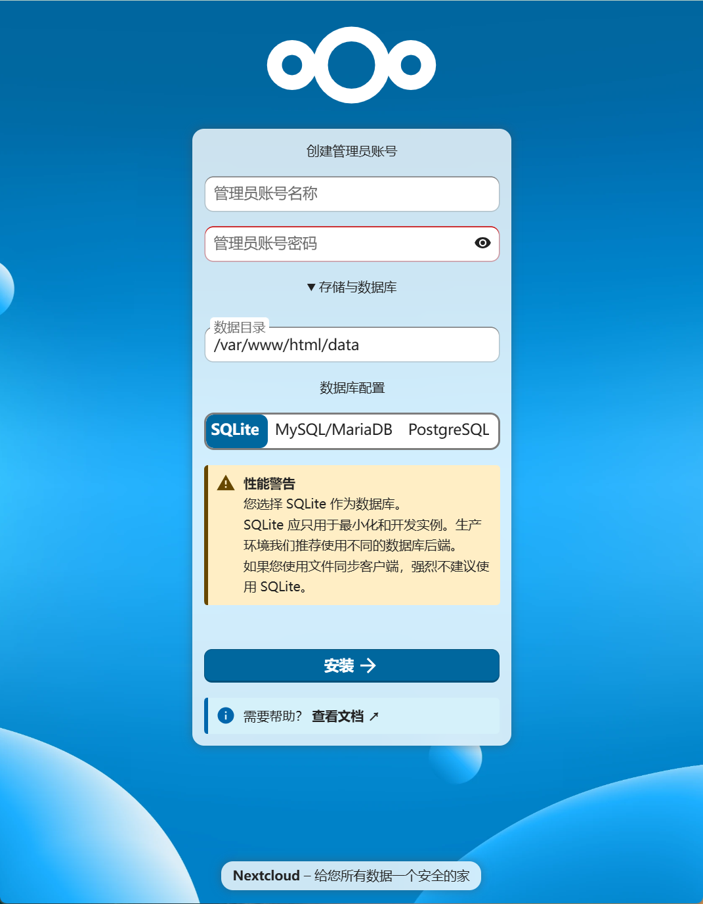

## 文件共享/云存储

  ## Nextcloud

[**Nextcloud**](https://nextcloud.com) 是 [开源](https://github.com/nextcloud) 的私有云服务。用户可以把文件、协作、聊天和日历都放在自己可控的服务器上，支持浏览器、桌面和Android/iOS访问。


**特点：**

- 开源、自托管的私有云平台，数据由你掌控。  
- 文件同步与共享（版本、回收站、密码/过期链接）。  
- 在线协作（可接入 Collabora/ONLYOFFICE，多人实时编辑）。  
- 即时消息与音视频会议（Nextcloud Talk）。  
- 日历/联系人/邮件同步（CalDAV/CardDAV/IMAP）。  
- 客户端：Web、桌面（Windows/macOS/Linux）、移动（Android/iOS）。  
- 安全与认证：LDAP/SSO、2FA、服务器端加密，可选端到端加密。  
- 可扩展：应用商店、WebDAV/REST API、挂载外部存储（S3/SMB等）。  
- 部署灵活：单机/Docker/Snap/Kubernetes，支持高可用与对象存储。  
- 适用场景：需要数据主权与企业级协作的个人、团队或组织。


**安装服务：**

```shell
# https://hub.docker.com/_/nextcloud
$ mkdir -p ~/.local/nextcloud

$ docker pull nextcloud

$ docker run -d \
  --name nextcloud \
  -p 8084:80 \
  -e NEXTCLOUD_ADMIN_USER=admin \
  -e NEXTCLOUD_ADMIN_PASSWORD=123456 \
  -v ~/.local/nextcloud/html:/var/www/html \
  -v ~/.local/nextcloud/config:/var/www/html/config \
  -v ~/.local/nextcloud/data:/var/www/html/data \
  -v ~/.local/nextcloud/custom_apps:/var/www/html/custom_apps \
  nextcloud:latest
    
$ docker rm -f nextcloud
```


**初始化**



-  建议使用postgresql，须提前准备好外部数据库。
- 数据目录优先使用docker参数指定的目录，此处不用动。


**安装客户端**

_参考官方资料：https://nextcloud.com/install/#install-clients_


## Cloudreve

https://docs.cloudreve.org/zh/overview/deploy/docker

https://hub.docker.com/r/cloudreve/cloudreve

https://github.com/cloudreve/Cloudreve/blob/master/README_zh-CN.md

```shell
mkdir -p ~/.local/cloudreve/data

# 简单安装
docker run -d --name cloudreve \
    -p 8212:5212 \
    -p 8886:6888 \
    -p 8886:6888/udp \
    -v ~/cloudreve/data:/cloudreve/data \
    cloudreve/cloudreve:latest

# 外部数据库（推荐）
docker run --name cloudreve \
    -p 8212:5212 \
    -p 8886:6888 \
    -p 8886:6888/udp \
    -v ~/.local/cloudreve/data:/cloudreve/data \
    -e CR_CONF_Database.Type=postgres \
    -e CR_CONF_Database.Host=192.168.3.31 \
    -e CR_CONF_Database.Port=5432 \
    -e CR_CONF_Database.User=postgres \
    -e CR_CONF_Database.Password=123456 \
    -e CR_CONF_Database.Name=cloudreve \
    -d cloudreve/cloudreve:latest
     
docker rm -f cloudreve
```


## Quantum

[**Quantum**](https://filebrowserquantum.com/en/) 最佳免费自托管 Web 文件管理器，具有**可配置源**、**OIDC 身份验证**、**Office 文件支持**和**实时索引功能**。 

**Docker安装**  参考[官方文档](https://filebrowserquantum.com/en/docs/getting-started/docker/)

```shell
docker run -d \
  -v /path/to/your/folder:/srv \
  -p 80:80 \
  gtstef/filebrowser:beta
```


