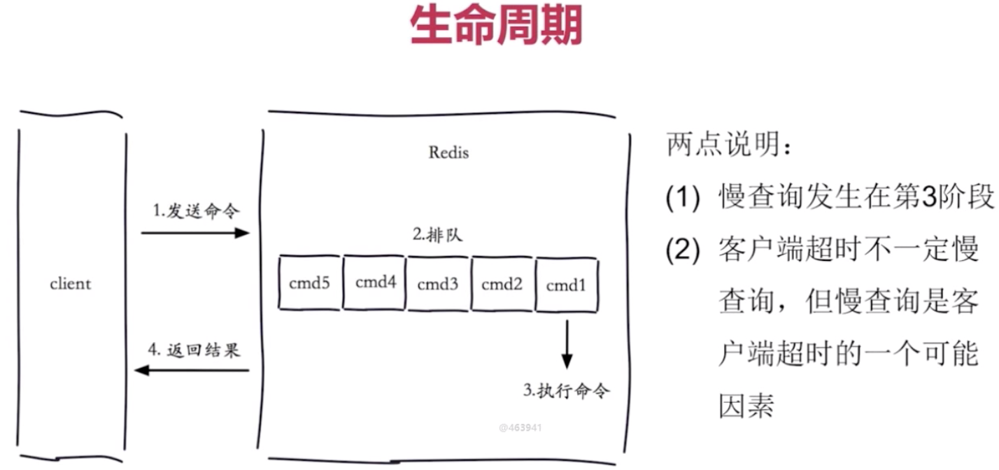
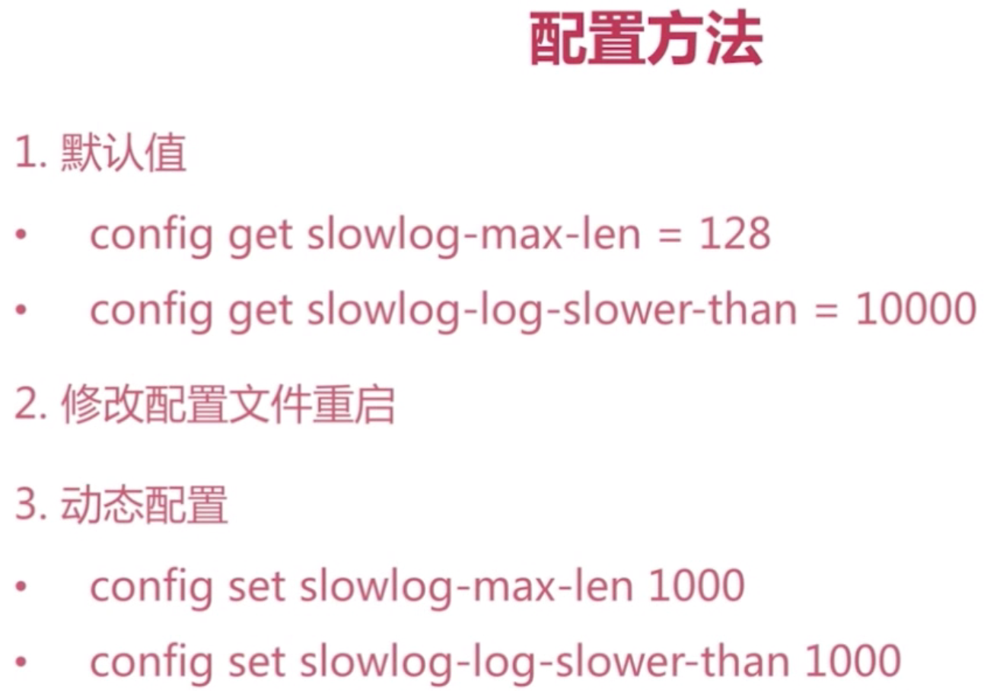
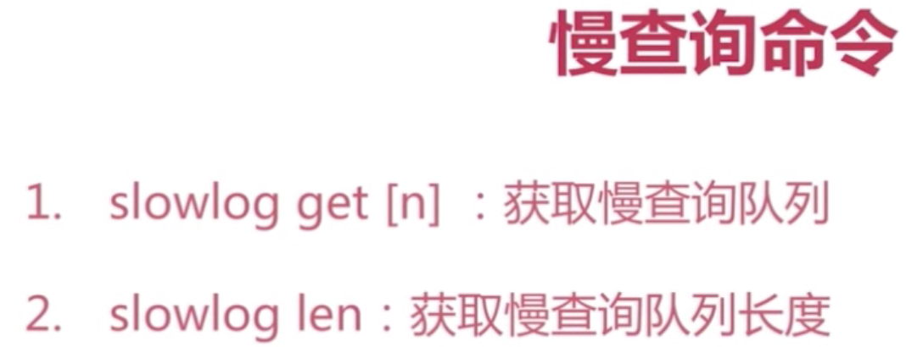

[TOC]

# 慢查询









https://segmentfault.com/a/1190000009915519


# Redis管道

>   Pipeline的RTT(Round Trip Time,即往返时间)分四步： `发送命令 => 命令排队 => 命令执 => 返回结果`

1.   `Pipeline`是**`1次网络，N次命令`**(非原子操作,不同于`mset`等)；
2.   `Pipeline`每次只能作用在一个Redis节点上,即**不能用于集群**；

```shell
# en：处理特殊字符,不换行输出
$ echo -en "incr x\n incr x\n incr x\n"|redis-cli --pipe      # 终端提交
$ echo -en "incr x\n incr x\n incr x\n"|nc localhost 6379      # 接口提交
```

**Golang中使用Redis-Pipeline：**

```go
// github.com/go-redis/redis/v8
func main() {
    rdb = redis.NewClient(&redis.Options{Addr:"10.0.0.8:6379"})
    _pipe := rdb.Pipeline()
    _pipe.Set(ctx, "key1", 100, 0)
    _pipe.Get(ctx, "key1")
    _pipe.Set(ctx, "key2", 200, 0)
    _pipe.Get(ctx, "key2")
    result, err := _pipe.Exec(ctx)
    if err != nil {
        panic(err)
    }

    for _, c := range result {
        fmt.Printf("%+v,%v,%v\n", c.Name(),c.Args(),c.Err())
    }
}
```


# Redis事务

**事务三阶段：**

-   开启：以MULTI开始一个事务；
- 入队：将多个命令入队到事务中，接到这些命令并不会立即执行，而是放到等待执行的事务队列里面；
-   执行：由EXEC命令触发事务；

**事务三大特性：**

-   单独的隔离操作： 事务中的所有命令都会序列化、按顺序地执行。执行过程不会被其他客户命令所打断；
- 无隔离级别概念： 事务提交前任何指令都不会被实际执行，也就不存在”事务内的数据修改只能在事务内被查询"的问题；
- 不保证原子性： 同一个事务中内的某条命令执行失败，其后的命令仍然会被执行，**没有回滚**；

**事务演示：**

```shell
127.0.0.1:6379> multi                # 开启事务
OK
127.0.0.1:6379(TX)> set tx_test 1            
QUEUED                                # 命令入列
127.0.0.1:6379(TX)> incr tx_test
QUEUED                                # 命令入列
127.0.0.1:6379(TX)> exec            # 执行事务(discard取消事务)
1) OK
2) (integer) 2
```

**Golang中使用Redis事务: **

```shell
func ExampleTx() {
    log.Println("======================== TX ========================")
    pipe := rdb.TxPipeline()
    defer pipe.Close()
    pipe.SetNX(ctx, "tx_test", 100, 3*time.Second)
    v := pipe.Incr(ctx, "tx_test").Val()
    v = pipe.Incr(ctx, "tx_test").Val()
    ret, err := pipe.Exec(ctx)
    if err != nil {
        pipe.Discard() // 取消事务
    }
    log.Printf("%v,%+v\n", v, ret)
}
```


# 发布订阅

>   Redis 发布订阅(pub/sub)是一种消息通信模式：发送者(pub)发送消息，订阅者(sub)接收消息。

```shell
# 客户端/订阅者
127.0.0.1:6379> subscribe test_channel
Reading messages... (press Ctrl-C to quit)
1) "subscribe"
2) "test_channel"
3) (integer) 1
1) "message"
2) "test_channel"
3) "hello"
```

```shell
# 服务端/发布者
127.0.0.1:6379> publish test_channel hello
(integer) 1
127.0.0.1:6379>
```

秒杀
点赞
购物车
好友推荐
 好友关注
文章阅读量


# Lua脚本
https://www.runoob.com/redis/redis-scripting.html


https://www.cnblogs.com/-wenli/p/12922089.html
http://www.manongjc.com/detail/15-sqazuuwokhqoret.html


