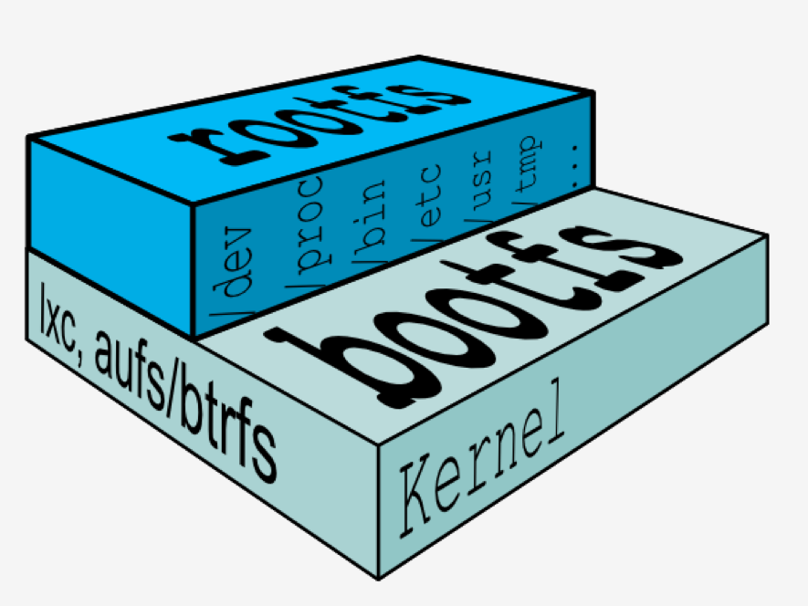
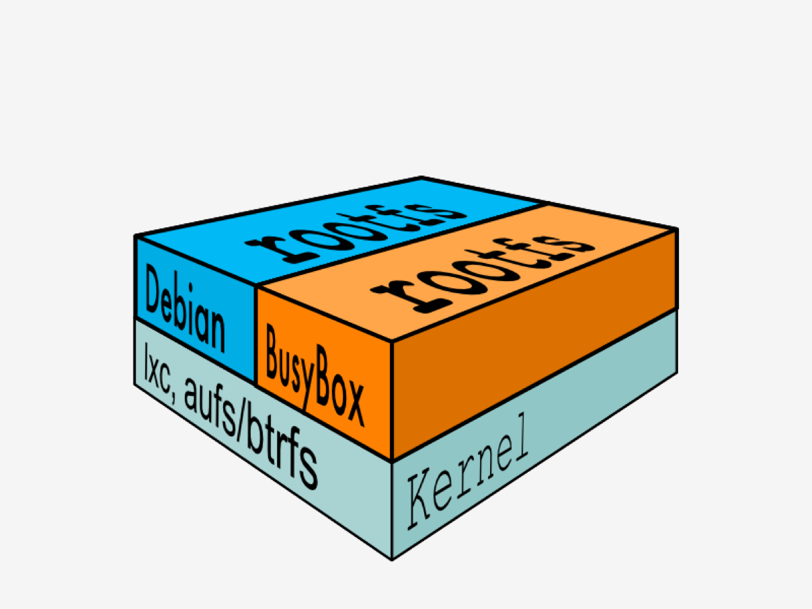
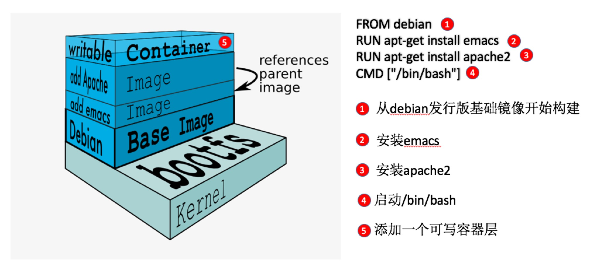
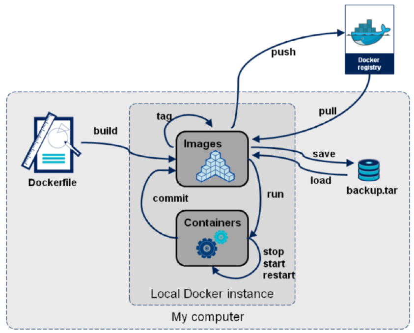

# Docker 镜像

## 最小镜像

镜像到底包含什么呢？容器为什么是轻量级的虚拟化呢？

```shell
$ docker images
REPOSITORY    TAG       IMAGE ID       CREATED         SIZE
hello-world   latest    feb5d9fea6a5   17 months ago   13.3kB

$ docker run --rm hello-world
Hello from Docker!
This message shows that your installation appears to be working correctly.
...

$ docker history hello-world
IMAGE          CREATED         CREATED BY                                      SIZE      COMMENT
feb5d9fea6a5   17 months ago   /bin/sh -c #(nop)  CMD ["/hello"]               0B
<missing>      17 months ago   /bin/sh -c #(nop) COPY file:50563a97010fd7ce…   13.3kB
```

首先从一个最小的镜像hello-world讲起，它肯定是不包括Linux的内核的，因为现在Linux内核大小至少100MB以上。

这么小的镜像，它能运行，是一个完整的镜像，他是怎么构建出来的呢？

/hello 就是文件系统的全部内容，连最基本的 /bin，/usr, /lib, /dev 都没有。


## Base镜像

Base镜像指不依赖其他镜像，从scratch构建，其他镜像可以以之为基础镜像进行扩展。

能称作 base 镜像的通常都是各种 Linux 发行版的 Docker 镜像，比如 Ubuntu, Debian, CentOS 等。


一个CentOS镜像为什么还不到200MB？

Linux 操作系统由内核空间和用户空间组成。内核空间是 kernel，Linux 刚启动时会加载 bootfs 文件系统，之后 bootfs 会被卸载掉，rootfs被加载。用户空间的文件系统是 rootfs，包含我们熟悉的 /dev, /proc, /bin 等目录。



不同 Linux 发行版的区别主要就是 rootfs。比如 Ubuntu 14.04 使用 upstart 管理服务，apt 管理软件包；而 CentOS 7 使用 systemd 和 yum。这些都是用户空间上的区别，Linux kernel 差别不大。



对于 base 镜像来说，底层直接用 Host 的 kernel，自己只需要提供 rootfs 就行了。而对于一个精简的 OS，rootfs 可以很小，只需要包括最基本的命令、工具和程序库就可以了。

相比其他 Linux 发行版，CentOS 的 rootfs 已经算臃肿的了，alpine 还不到 10MB。

如下，在CentOS 7宿主机上运行 Ubuntu 16.04容器，看到的容器内核和宿主机的内核相同，容器复用了宿主机的内核：


## 镜像的分层结构

如下图所示，镜像是分层存储：



为什么镜像采用分层结构呢？

最大的好处就是资源共享，比如有多个镜像从同一个base镜像构建而来，宿主机上只需要有一份base镜像就可以了，多个镜像共用同一个base镜像。

多个容器共用同一个base镜像，当某个容器修改配置时，其他容器也会修改吗？

答案是不会，因为最上面的容器层是可写的，下面的其他层（镜像层）都是只读，当需要修改下层的文件时，会先复制此文件到上面的容器层，然后再修改。容器层记录对镜像的修改，所有镜像层都是只读的，不会被容器修改，所以镜像可以被多个容器共享。


## 镜像生命周期




