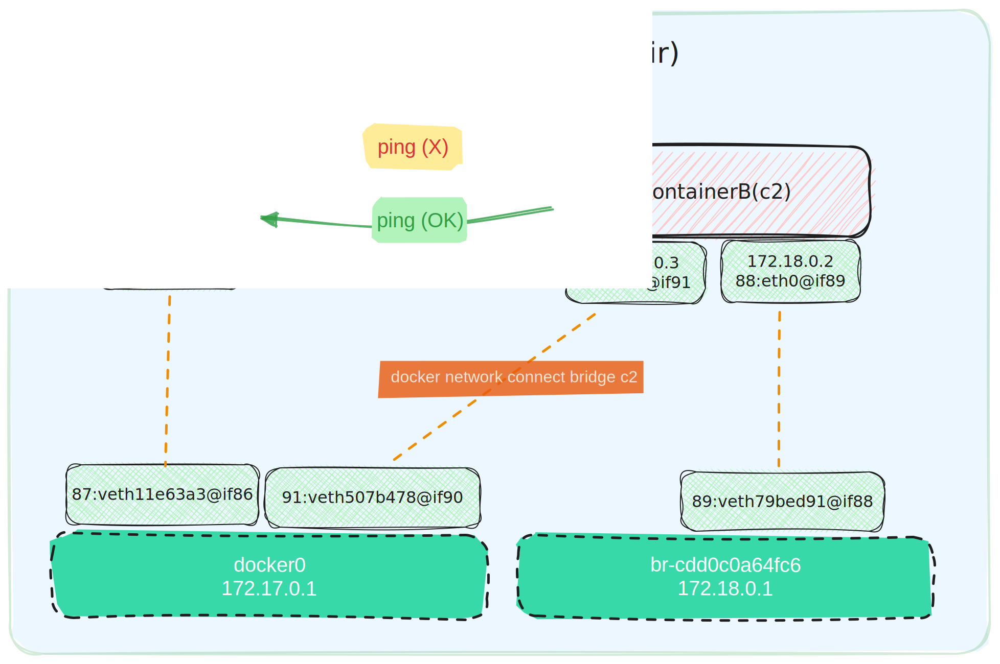
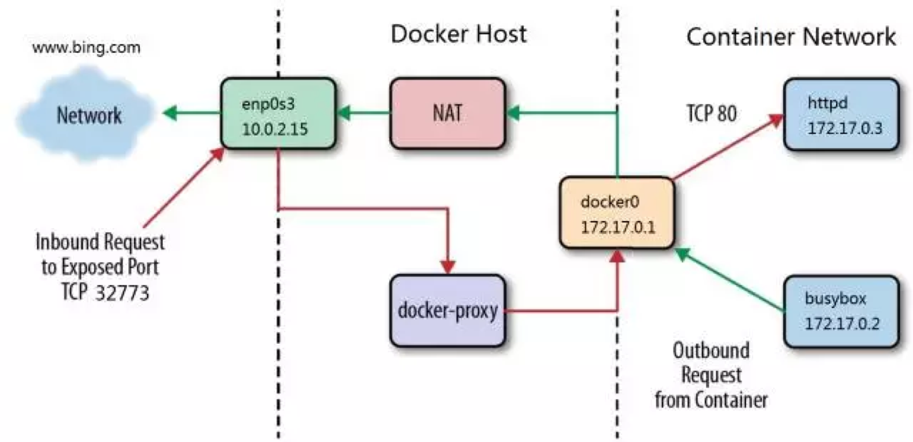

# 本地网络

## 1. None模式

> None网络模式下**仅有lo网卡，不可访问以太网或互联网**。

```shell
# 正常网络 (有eth0和lo网络，可访问以太网和互联网)
docker run --rm busybox ifconfig
docker run --rm busybox ping 172.17.0.1
docker run --rm busybox ping 8.8.8.8
```

```shell
# none网络
docker run --network=none --rm busybox ifconfig
```


## 2. Bridge模式

Docker中的bridge模式是一种**NAT网络**。Docker会在**宿主机**上创建一个**docker0**虚拟网桥 (**虚拟交换机**)。

### 2.1  默认网桥

```shell
# 使用busybox镜像分别运行 box0，box1两个容器：
docker run -dt --name box0 busybox
docker run -dt --name box1 busybox

# 查看两个容器的IP地址
docker network inspect bridge|grep IPv4
docker inspect --format '{{ .NetworkSettings.IPAddress }}' box0  #172.17.0.2
docker inspect --format '{{ .NetworkSettings.IPAddress }}' box1  #172.17.0.3
docker exec box0 ifconfig
docker exec box1 ifconfig

# 测试两个容器互通性
docker exec box0 ping 172.17.0.3 -c 3
docker exec box1 ping 172.17.0.2 -c 3
docker exec box1 ping 8.8.8.8 -c 3
docker exec box1 ping host.docker.internal
```


### 2.2 自定义网桥

```shell
# -d 指定管理网络的驱动方式，默认为bridge
# --subnet 指定子网网段
# --gateway 指定默认网关
# docker network create -d bridge --subnet '172.18.0.0/24' --gateway '172.18.0.1' br0
docker network create  br0
docker network inspect br0
docker network ls

# 创建两个新容器，并指定网桥
docker run -dt --network br0 --name box2 busybox
docker run -dt --network br0 --name box3 busybox
docker exec box2 ifconfig eth0
docker exec box3 ifconfig eth0

# 测试两个容器互通性
docker exec box2 ping box3
docker exec box3 ping box2
```

_在自定义网桥中，容器名会在需要的时候自动解析到对应的IP。_


### 2.3 网络连接

目前为止，bridge(默认网桥)与br0不能互通，如何实现跨bridge网络的通信呢？

```shell
# 将box0和box2连接起来 
docker exec box0 ping 172.18.0.2
docker exec box2 ping 172.17.0.2

docker network connect bridge box0
docker network connect bridge box2
```


```shell
# 安装brctl工具
yum install -y bridge-utils

# 查看网桥(虚拟交换机)
[root@k8s ~]# brctl show
bridge name			bridge id			STP enabled		interfaces
docker0				8000.0242da4318fb	no				veth069cc6e
														vethcd704d4
br-816f8c7150dc		8000.02420575b501	no				veth746927a
														vetha958727

# 查看docker网络
[root@k8s-master ~]# docker network ls
NETWORK ID     NAME      DRIVER    SCOPE
816f8c7150dc   br0       bridge    local (br-816f8c7150dc)
229da6f695f7   bridge    bridge    local (docker0)
13a2b4a33c06   host      host      local
f53f80aa84c1   none      null      local
```

### 2.4 bridge拓扑



```shell
$ ip link list
...
# "87: veth11e63a3@if86"表示索引号为87的接口是一个虚拟以太网设备（veth），它通过与索引号为86的其他网络设备相连接。    
87: veth11e63a3@if86:... mtu 1500 qdisc noqueue master docker0 ...
89: veth79bed91@if88:... mtu 1500 qdisc noqueue master br-cdd0c0a64fc6 ...
```


```shell
[root@k8s-master ~]# ip link list

# 容器C1
docker exec c1 ifconfig
docker exec c1 ip link list

docker exec c2 ifconfig
docker exec c2 ip link list

# 查看宿主机
ip link list
```


## 3. Host模式

在主机模式下，容器和主机共享相同的网络命名空间，**容器可以直接访问主机上的网络资源，并且可以使用主机上所有的端口**。主机模式的优点是容器的网络性能更好，但容器之间的**隔离性较差**。

```shell
# 与主机网络列表相同(格式不一致)
docker run --network=host --rm busybox ifconfig

# 网络完全不隔离，可以访问任务network下的容器
python3 -m http.server 8080 --bind 0.0.0.0 &

docker run -it --rm --network host alpine sh -c "apk add curl && curl http://localhost:8080"

# 替换为阿里云镜像源
docker run -it --rm --network host alpine sh -c "
  echo 'https://mirrors.aliyun.com/alpine/v3.22/main/' > /etc/apk/repositories && \
  echo 'https://mirrors.aliyun.com/alpine/v3.22/community/' >> /etc/apk/repositories && \
  apk update && \
  apk add curl && \
  curl http://host.docker.internal:8080
"

# 处理端口占用
lsof -i :8080
```


# 跨主机网络

跨主机网络方案有：

- 原生网络方案，包括**overlay**和 **macvlan**。

- 第三方网络方案：包括 **Calico** (Kubernetes)、**Flannel** (CoreOS)、**Weave**等。

## Overlay方案

Docerk overlay 网络需要一个 key-value 数据库用于保存网络状态信息，包括 Network、Endpoint、IP 等。Consul、Etcd 和 ZooKeeper 都是 Docker 支持的 key-vlaue 软件，我们这里使用 Consul。

1、部署Consul

```bash
docker run -d -p 8500:8500 -h consul --name consul progrium/consul -server -bootstrap
```

2、接下来修改 host1 和 host2 的 docker daemon 的配置文件/etc/systemd/system/docker.service.d/10-machine.conf
--registry-mirror=https://m9sl8pb5.mirror.aliyuncs.com --cluster-store=consul://192.168.115.20:8500 --cluster-advertise=ens3:2376
--cluster-store 指定 consul 的地址--cluster-advertise 告知 consul 自己的连接地址

```bash
systemctl daemon-reload
systemctl restart docker.service
```

3、创建 overlay 网络 ov_net1

```bash
docker network create -d overlay ov_net1
```

4、在 host1 和 host2 上分别启动容器

```bash
docker run -tid --name box1 --network=ov_net1 busybox
docker run -tid --name box2 --network=ov_net1 busybox
```

5、联通性测试

```bash
docker exec -ti box2 sh
ping 10.0.0.2
```

**Overlay网络连通性**

docker 会为每个 overlay 网络创建一个独立的 network namespace，其中会有一个 linux bridge br0，endpoint 还是由 veth pair 实现，一端连接到容器中（即 eth0），另一端连接到 namespace 的 br0 上。

br0 除了连接所有的 endpoint，还会连接一个 vxlan 设备，用于与其他 host 建立 vxlan tunnel。容器之间的数据就是通过这个 tunnel 通信的。逻辑网络拓扑结构如图所示：


## Calico方案


# 容器的通信机制

### 容器访问外部世界

a、busybox 发送 ping 包：172.17.0.2 > www.bing.com

b、docker0 收到包，发现是发送到外网的，交给 NAT 处理

c、NAT 将源地址换成 enp0s3 的 IP：10.0.2.15 > www.bing.com

d、ping 包从 enp0s3 发送出去，到达 www.bing.com

### 外部世界访问容器

外部网络通过端口映射访问到容器服务，将容器的80端口映射到宿主机的32773端口

```bash
docker run -tid --name httpd -p 32773:80 httpd
```

a、docker-proxy 监听 host 的 32773 端口

b、当 curl 访问 10.0.2.15:32773 时，docker-proxy 转发给容器 172.17.0.2:80

c、httpd 容器响应请求并返回结果




