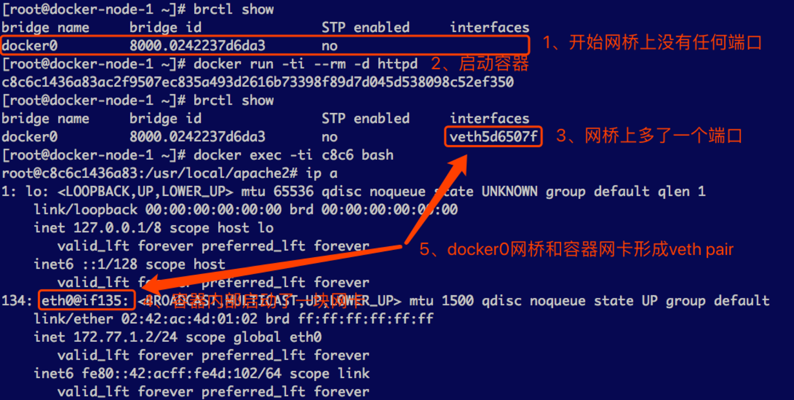
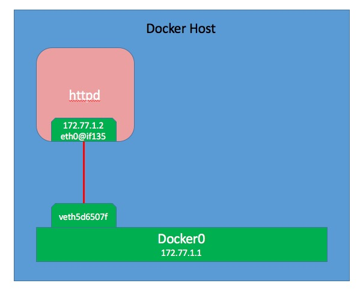
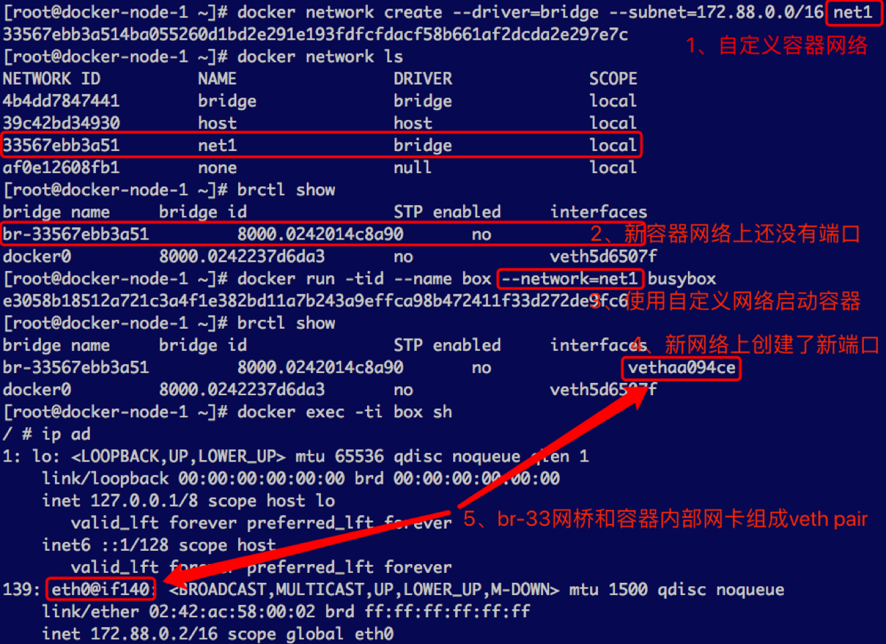
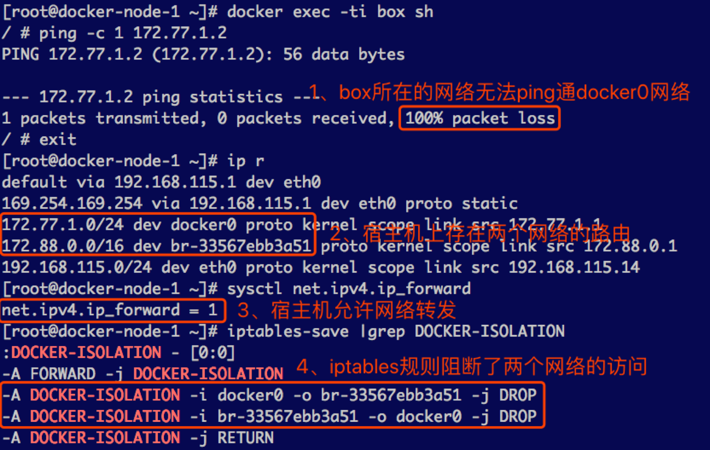
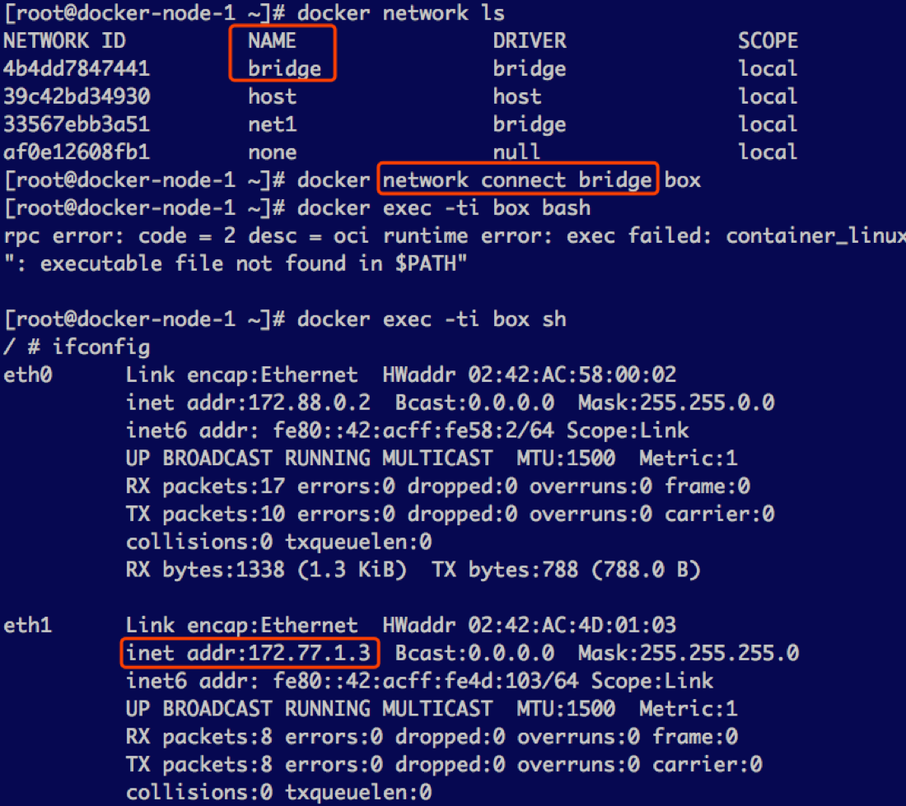
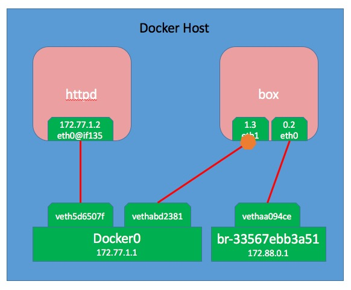
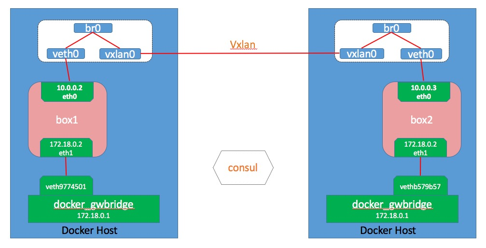

# 本地网络

## none网络

> 这个网络下的容器除了 lo，没有其他任何网卡

```shell
# 正常网络
$ docker run -ti --rm alpine sh -c "ping 8.8.8.8"
```

```shell
# none网络
$ docker run -ti --rm --network=none alpine sh -c "ping 8.8.8.8"
PING 8.8.8.8 (8.8.8.8): 56 data bytes
ping: sendto: Network unreachable

# 查看网卡
$ docker run -ti --rm --network=none alpine sh -c "ifconfig"
lo        Link encap:Local Loopback  
          inet addr:127.0.0.1  Mask:255.0.0.0
          UP LOOPBACK RUNNING  MTU:65536  Metric:1
          RX packets:0 errors:0 dropped:0 overruns:0 frame:0
          TX packets:0 errors:0 dropped:0 overruns:0 carrier:0
          collisions:0 txqueuelen:1000
          RX bytes:0 (0.0 B)  TX bytes:0 (0.0 B)
```


## host网络

> 使用 host 网络，容器和宿主机共用 host 网络，当启动服务时应该避免端口冲突

```shell
$ docker run -ti --rm --network=host alpine sh -c "ifconfig"
docker0   Link encap:Ethernet  HWaddr 02:42:E0:49:4C:85  
          inet addr:172.17.0.1  Bcast:172.17.255.255  Mask:255.255.0.0
          inet6 addr: fe80::42:e0ff:fe49:4c85/64 Scope:Link
          UP BROADCAST MULTICAST  MTU:1500  Metric:1
          RX packets:13489 errors:0 dropped:0 overruns:0 frame:0
          TX packets:35207 errors:0 dropped:0 overruns:0 carrier:0
          collisions:0 txqueuelen:0 
          RX bytes:575543 (562.0 KiB)  TX bytes:50010152 (47.6 MiB)

eth0      Link encap:Ethernet  HWaddr 02:50:00:00:00:01  
          inet addr:192.168.65.3  Bcast:192.168.65.255  Mask:255.255.255.0
          inet6 addr: fe80::50:ff:fe00:1/64 Scope:Link
          UP BROADCAST RUNNING MULTICAST  MTU:1500  Metric:1
          RX packets:307626 errors:0 dropped:0 overruns:0 frame:0
          TX packets:75354 errors:0 dropped:0 overruns:0 carrier:0
          collisions:0 txqueuelen:1000 
          RX bytes:451923123 (430.9 MiB)  TX bytes:4794857 (4.5 MiB)

lo        Link encap:Local Loopback  
          inet addr:127.0.0.1  Mask:255.0.0.0
          inet6 addr: ::1/128 Scope:Host
          UP LOOPBACK RUNNING  MTU:65536  Metric:1
          RX packets:52 errors:0 dropped:0 overruns:0 frame:0
          TX packets:52 errors:0 dropped:0 overruns:0 carrier:0
          collisions:0 txqueuelen:1000 
          RX bytes:4392 (4.2 KiB)  TX bytes:4392 (4.2 KiB)
...          
```


## bridge网络

> Docker 安装时会创建一个命名为 docker0 的 linux bridge。如果不指定\-\-network，创建的容器默认都会挂到 docker0 上。

```shell
$ docker run -ti --rm --network=bridge alpine sh -c "ifconfig"
eth0      Link encap:Ethernet  HWaddr 02:42:AC:11:00:02  
          inet addr:172.17.0.2  Bcast:172.17.255.255  Mask:255.255.0.0
          UP BROADCAST RUNNING MULTICAST  MTU:1500  Metric:1
          RX packets:2 errors:0 dropped:0 overruns:0 frame:0
          TX packets:0 errors:0 dropped:0 overruns:0 carrier:0
          collisions:0 txqueuelen:0 
          RX bytes:200 (200.0 B)  TX bytes:0 (0.0 B)

lo        Link encap:Local Loopback  
          inet addr:127.0.0.1  Mask:255.0.0.0
          UP LOOPBACK RUNNING  MTU:65536  Metric:1
          RX packets:0 errors:0 dropped:0 overruns:0 frame:0
          TX packets:0 errors:0 dropped:0 overruns:0 carrier:0
          collisions:0 txqueuelen:1000 
          RX bytes:0 (0.0 B)  TX bytes:0 (0.0 B)
```


## bridge拓扑

Docker Daemon启动后默认创建 docker0 网桥，起初 docker0 启动时网桥上没有任何端口，当启动容器后，docker0 网桥上也创建了一个端口，他跟容器内的 eth0 网卡形成一个 veth pair。



Docker 桥接网络拓扑图如下：



## 自定义网络

```bash
docker network create --driver=bridge --subnet=172.88.0.0/16 net1
docker run -tid --name box --network=net1 busybox
```



通过如上命令可以自定义网络，使用新建网络启动容器后，同样会创建一个 veth pair 与新网桥联通。

我想让box容器（自定义网络 net1）和httpd容器（默认网络 docker0）通信该怎么弄？

在 box 里 ping httpd 容器 ip 不通，这是因为 Docker 默认是隔离所有网络之间的通信的



为了能够通信只需要给 box 容器添加 docker0 网络



net1 与 docker0 网络拓扑：



# 多主机网络

Docker原生网络方案：

- overlay
- macvlan

第三方网络方案：

- Flannel
- Weave
- Calico

### 配置Overlay网络

Docerk overlay 网络需要一个 key-value 数据库用于保存网络状态信息，包括 Network、Endpoint、IP 等。Consul、Etcd 和 ZooKeeper 都是 Docker 支持的 key-vlaue 软件，我们这里使用 Consul。

1、部署Consul

```bash
docker run -d -p 8500:8500 -h consul --name consul progrium/consul -server -bootstrap
```

2、接下来修改 host1 和 host2 的 docker daemon 的配置文件/etc/systemd/system/docker.service.d/10-machine.conf
--registry-mirror=https://m9sl8pb5.mirror.aliyuncs.com --cluster-store=consul://192.168.115.20:8500 --cluster-advertise=ens3:2376
--cluster-store 指定 consul 的地址--cluster-advertise 告知 consul 自己的连接地址

```bash
systemctl daemon-reload
systemctl restart docker.service
```

3、创建 overlay 网络 ov_net1

```bash
docker network create -d overlay ov_net1
```

4、在 host1 和 host2 上分别启动容器

```bash
docker run -tid --name box1 --network=ov_net1 busybox
docker run -tid --name box2 --network=ov_net1 busybox
```

5、联通性测试

```bash
docker exec -ti box2 sh
ping 10.0.0.2
```

### Overlay网络连通性

docker 会为每个 overlay 网络创建一个独立的 network namespace，其中会有一个 linux bridge br0，endpoint 还是由 veth pair 实现，一端连接到容器中（即 eth0），另一端连接到 namespace 的 br0 上。

br0 除了连接所有的 endpoint，还会连接一个 vxlan 设备，用于与其他 host 建立 vxlan tunnel。容器之间的数据就是通过这个 tunnel 通信的。逻辑网络拓扑结构如图所示：



# 容器的通信机制

### 容器访问外部世界

a、busybox 发送 ping 包：172.17.0.2 > www.bing.com

b、docker0 收到包，发现是发送到外网的，交给 NAT 处理

c、NAT 将源地址换成 enp0s3 的 IP：10.0.2.15 > www.bing.com

d、ping 包从 enp0s3 发送出去，到达 www.bing.com

### 外部世界访问容器

外部网络通过端口映射访问到容器服务，将容器的80端口映射到宿主机的32773端口

```bash
docker run -tid --name httpd -p 32773:80 httpd
```

a、docker-proxy 监听 host 的 32773 端口

b、当 curl 访问 10.0.2.15:32773 时，docker-proxy 转发给容器 172.17.0.2:80

c、httpd 容器响应请求并返回结果


## 实践

```shell
docker network ls
docker network create my_docker_net

```

