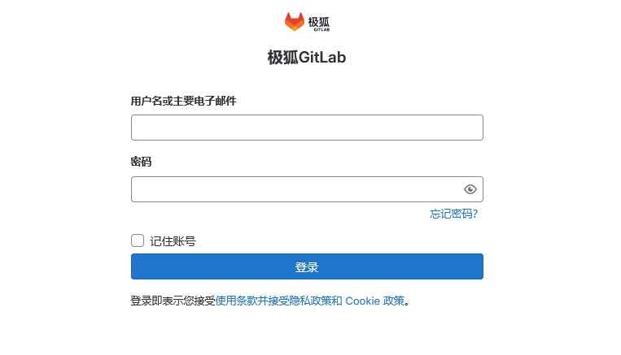

# 搭建Gitlab服务


## 1. 运行GitLab
```shell
# 创建挂载目录
mkdir -p ./var/gitlab/{config,logs,data}
sudo chmod -R 777 /var/gitlab

# 启动容器,注意替换域名或IP
sudo docker run --detach \
  --hostname git.mafool.com \
  --publish 9043:443 \
  --publish 9080:80 \
  --publish 9022:22 \
  --name gitlab \
  --restart always \
  --volume /var/gitlab/config:/etc/gitlab \
  --volume /var/gitlab/logs:/var/log/gitlab \
  --volume /var/gitlab/data:/var/opt/gitlab \
  gitlab/gitlab-ce:latest
```

_首次启动需要几分钟初始化，可通过`docker logs -f gitlab`查看进度。_


##  2. GitLab初始化

- 打开浏览器，访问服务器 IP 或域名（如`http://git.mafool.com`）。

- 首次登录需获取初始管理员密码：

  ```bash
  sudo docker exec -it gitlab grep 'Password:' /etc/gitlab/initial_root_password
  ```

- 登录用户名：`root`，输入上述密码，登录后建议立即修改密码。


<br/>


# 4. 配置GitLab服务
- 由于`22端口已经被宿主机占用`，所以我们必须另指定一个端口(`9022`)映射到gitlab上。
```shell
vim /var/gitlab/config/gitlab.rb
#************************gitlab配置************************
# 配置http协议
external_url 'http://192.168.xxx.xxx'    # 宿主机IP

# 配置ssh协议
gitlab_rails['gitlab_ssh_host'] = '192.168.xxx.xxx'
gitlab_rails['gitlab_shell_ssh_port'] = 9022
gitlab_rails['time_zone'] = 'Asia/Shanghai'
#*************************************************************
```


<br/>

# 5. 初始化root账号
浏览器访问 http://192.168.xxx.xxx:9080/ ，账号：`root`，密码见上一步操作。



Gitlab服务初始化较慢，遇到`502`错误或页面无法打开，请继续刷新等待...


## 备份还原


## 配置邮件


@[toc]
> **Gitlab官网：**  [https://about.gitlab.com/](https://about.gitlab.com/)
> **Gitlab安装：**   [https://gitlab.cn/install/](https://gitlab.cn/install/)


> 参考：
> [推荐]https://blog.csdn.net/michael_base/article/details/77966647
> https://blog.csdn.net/u014258541/article/details/79224492/
>
> https://blog.csdn.net/cen50958/article/details/93352349
>
> [CI/CD服务]：https://github.com/bravist/gitlab-ci-docker
>
> https://blog.csdn.net/sunyuhua_keyboard/article/details/124901471
>
> https://blog.csdn.net/jiangxiaoyi_07/article/details/131644370


https://blog.csdn.net/u011424614/article/details/150474643


