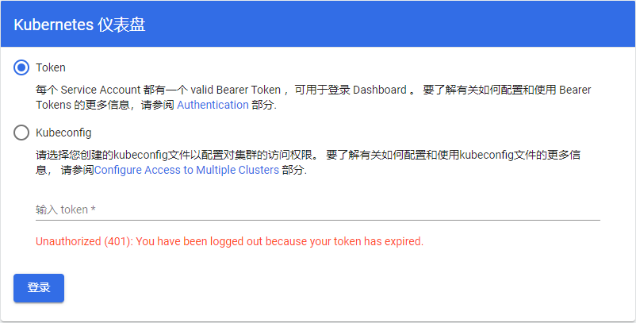

## 1. 创建服务

```shell
# 创建dashboard服务
wget https://raw.githubusercontent.com/kubernetes/dashboard/v2.5.0/aio/deploy/recommended.yaml
kubectl apply -f recommended.yaml

# 查看服务，此时的Type为ClusterIP,无法对外提供服务
kubectl get svc -A
```

>   查看`recommended.yaml`,  其中已包含了**ServiceAccount**, **ClusterRoleBinding**项，即默认的「用户」和「角色」，
>
>   如需自定义用户角色，可参考[kubernetes-dashboard官方文档](https://kubernetes.io/zh/docs/tasks/access-application-cluster/web-ui-dashboard/)。


## 2. 修改端口配置


```shell
export KUBE_EDITOR="vim"
kubectl edit svc kubernetes-dashboard -n kubernetes-dashboard
```
_修改如下两处配置项：_
```yaml
apiVersion: v1
kind: Service
metadata:
spec:
  clusterIP: 10.104.42.244
  clusterIPs:
  - 10.104.42.244
  externalTrafficPolicy: Cluster
  internalTrafficPolicy: Cluster
  ipFamilies:
  - IPv4
  ipFamilyPolicy: SingleStack
  ports:
  - nodePort: 30001	  # 自定义的外部端口(30000+)
    port: 443
    protocol: TCP
    targetPort: 8443
  selector:
    k8s-app: kubernetes-dashboard
  sessionAffinity: None
  type: NodePort	  # 改为NodePort
status:
  loadBalancer: {}
```


## 3. 获取令牌

```shell
# 先获取token名称，再获取令牌信息
kubectl -n kubernetes-dashboard describe secret $(kubectl -n kubernetes-dashboard get secret|grep admin-user|awk '{print $1}')
```


## 4. 浏览器查看

使用上一步获得的token，访问任意集群节点，如：https://10.0.0.11:30001 





## 5. 删除服务

```shell
# 用于服务异常或其他原因
kubectl delete service kubernetes-dashboard -n kubernetes-dashboard
```


## 参考资料：

https://github.com/kubernetes/dashboard


```shell
mkdir key && cd key
#生成证书
openssl genrsa -out dashboard.key 2048 
openssl req -new -out dashboard.csr -key dashboard.key -subj '/CN=192.168.246.200'
openssl x509 -req -in dashboard.csr -signkey dashboard.key -out dashboard.crt 
#删除原有的证书secret
kubectl delete secret kubernetes-dashboard-certs -n kube-system
#创建新的证书secret
kubectl create secret generic kubernetes-dashboard-certs --from-file=dashboard.key --from-file=dashboard.crt -n kube-system
#查看pod复制dashboard的pod名称
kubectl get pod -n kube-system
#重启pod（删除会自动重启）
kubectl delete pod <pod name> -n kube-system
```


