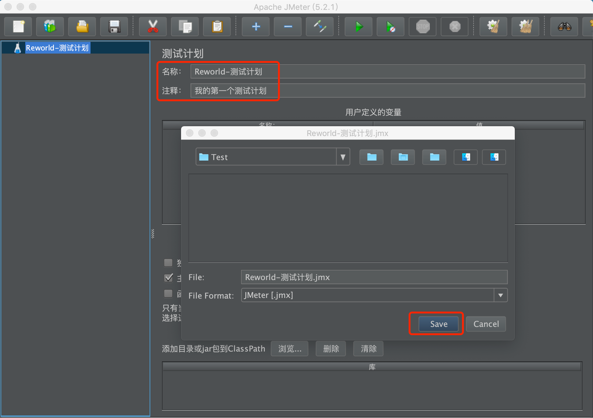
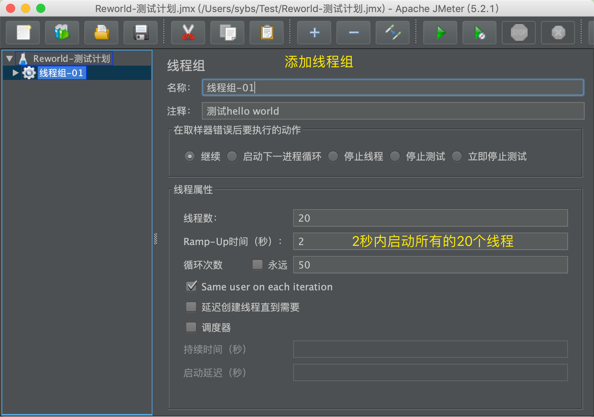
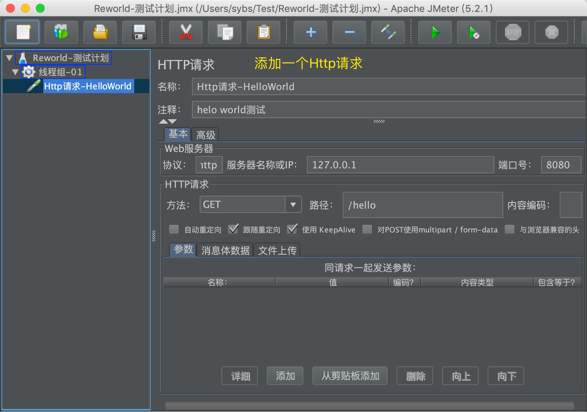
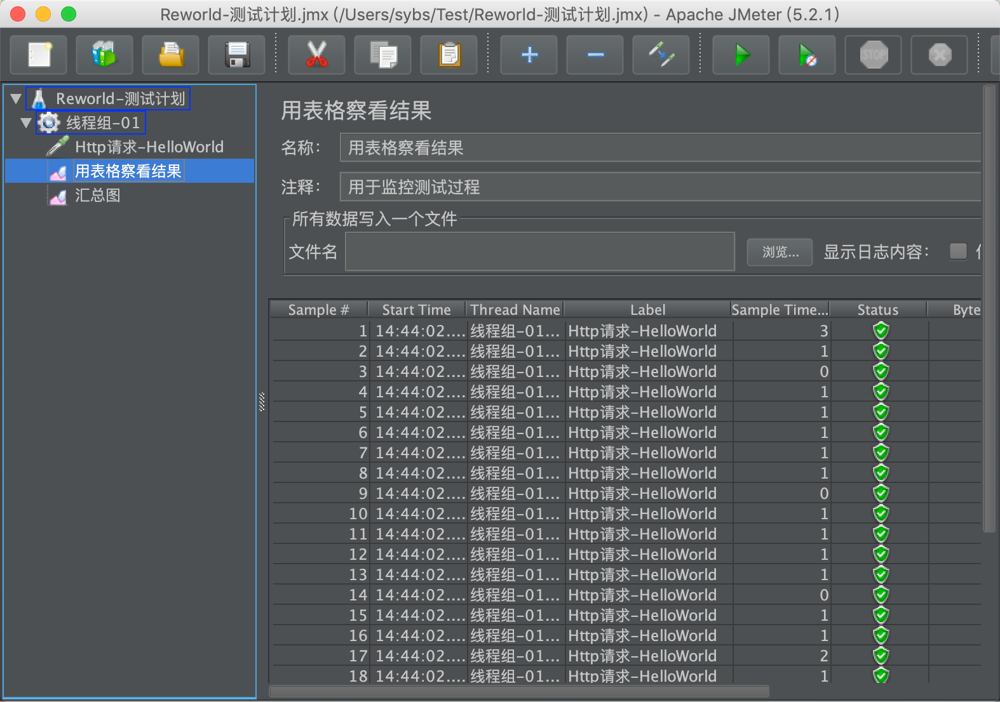

[TOC]

##  一. 下载安装JMeter
- [下载并安装](https://blog.csdn.net/Gusand/article/details/99680190)`Java8+`;
- [下载并安装]( http://jmeter.apache.org/download_jmeter.cgi)`Jmeter`；
```sh
# 查看Java版本
java -version

# 启动Jmeter
$JMETER_HOME/bin/jmeter
```

## 安装插件

## 二. 测试指标概念
- `QPS`：Queries Per Second，顾名思义：“每秒查询率”，是一台服务器每秒能够相应的查询次数，是对一个特定的查询服务器在规定时间内所处理流量多少的衡量标准。
- `TPS`：是TransactionsPerSecond的缩写，也就是事务数/秒。它是软件测试结果的测量单位。一个事务是指一个客户机向服务器发送请求然后服务器做出反应的过程。客户机在发送请求时开始计时，收到服务器响应后结束计时，以此来计算使用的时间和完成的事务个数。


TPS处理流程：Tps即每秒处理事务数，包括了
- 1、用户请求服务器
- 2、服务器自己的内部查询等处理
- 3、服务器返回给用户
这三个过程，每秒能够完成N个这三个过程，Tps也就是3；

>QPS基本类似于TPS，但是不同的是，对于一个页面的一次访问，形成一个TPS；但一次页面请求，可能产生多次对服务器的请求，服务器对这些请求，就可计入QPS之中。每秒查询率QPS是对一个特定的查询服务器在规定时间内所处理流量多少的衡量标准
一个事务是指一个客户机向服务器发送请求然后服务器做出反应的过程。客户机在发送请求时开始计时，收到服务器响应后结束计时，以此来计算使用的时间和完成的事务个数。
如果是对一个接口（单场景）压测，且这个接口内部不会再去请求其它接口，那么TPS等于QPS，否则，TPS不等于QPS


## 三. 测试计划示例







- `线程组右键`=> `添加`=> `监控器` => `用表格查看结果/汇总图`




## 四. 参考连接
https://www.cnblogs.com/summer-mm/p/7717812.html
https://www.jianshu.com/p/0e6bf15b3ffa
https://www.jianshu.com/p/2fff42a9dfcf
