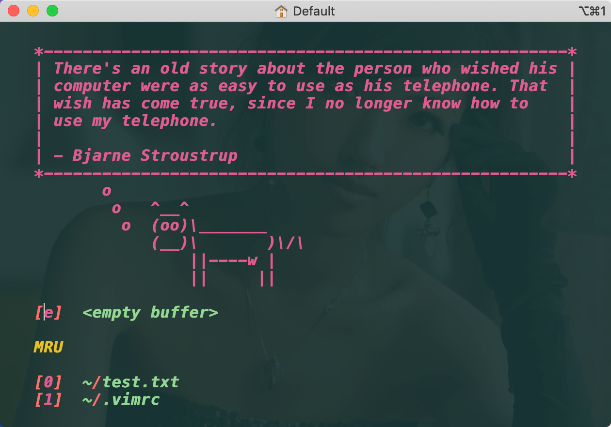

https://www.cnblogs.com/wongeo/p/14503386.html


# 
https://www.jianshu.com/p/923aec861af3?utm_campaign=maleskine&utm_content=note&utm_medium=seo_notes&utm_source=recommendation


# 插件管理
- [Vim-plug](https://github.com/junegunn/vim-plug)是vim中[最推荐的](https://www.slant.co/topics/1224/~best-plugin-managers-for-vim)一款插件管理工具 ,官方文档都有详细的安装使用说明。
```shell
# 编辑vimrc
$ vim ~/.vimrc
```
```txt
curl -fLo ~/.vim/autoload/plug.vim --create-dirs https://raw.githubusercontent.com/junegunn/vim-plug/master/plug.vim


" 打开vim时自动安装vim-plug
if empty(glob('~/.vim/autoload/plug.vim'))
silent !curl -fLo ~/.vim/autoload/plug.vim --create-dirs https://raw.githubusercontent.com/junegunn/vim-plug/master/plug.vim
  autocmd VimEnter * PlugInstall --sync | source $MYVIMRC
endif
  
" plugged是插件安装的目录
call plug#begin('~/.vim/plugged')

" 一个有意思的开屏插件
Plug 'mhinz/vim-startify'

call plug#end()
```
- 执行`source ～/.vimrc`,并在vim执行`:PlugInstall`命令安装插件，再次打开vim时，可看见如下的开屏界面。



<br/>


https://www.jianshu.com/p/d908ce81017a?nomobile=yes
https://github.com/ycm-core/YouCompleteMe/wiki/Building-Vim-from-source


https://segmentfault.com/a/1190000008097357

https://www.jianshu.com/p/48749100614d


安装YCM
yum install gcc-c++
yum install cmake

macvim
https://www.jianshu.com/p/923aec861af3?utm_campaign=maleskine&utm_content=note&utm_medium=seo_notes&utm_source=recommendation
https://www.jianshu.com/p/43b965e6e86b

