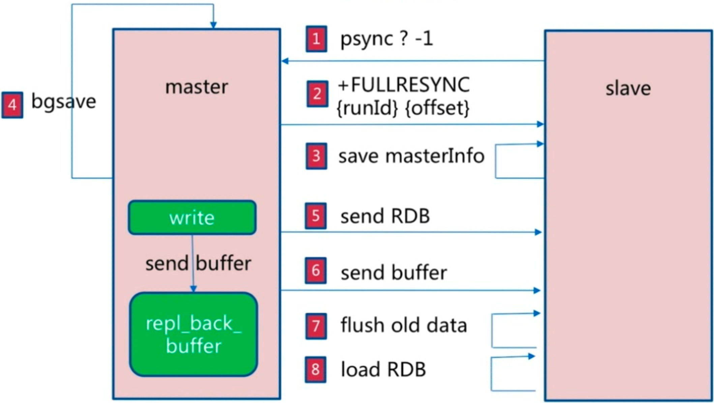
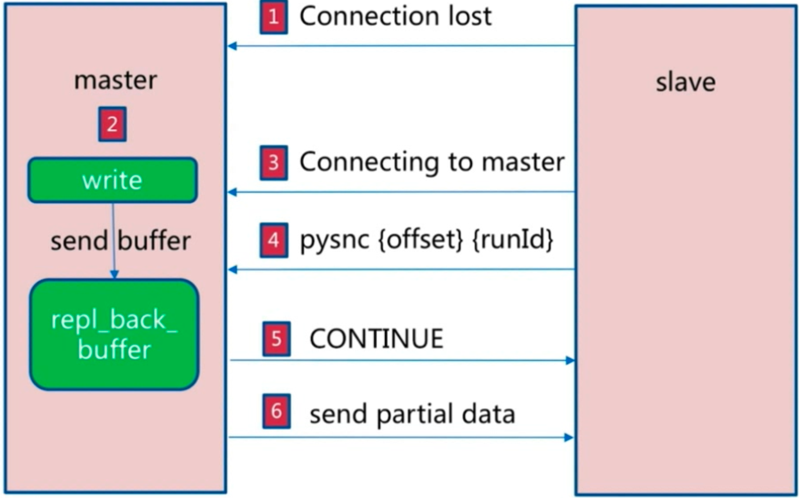
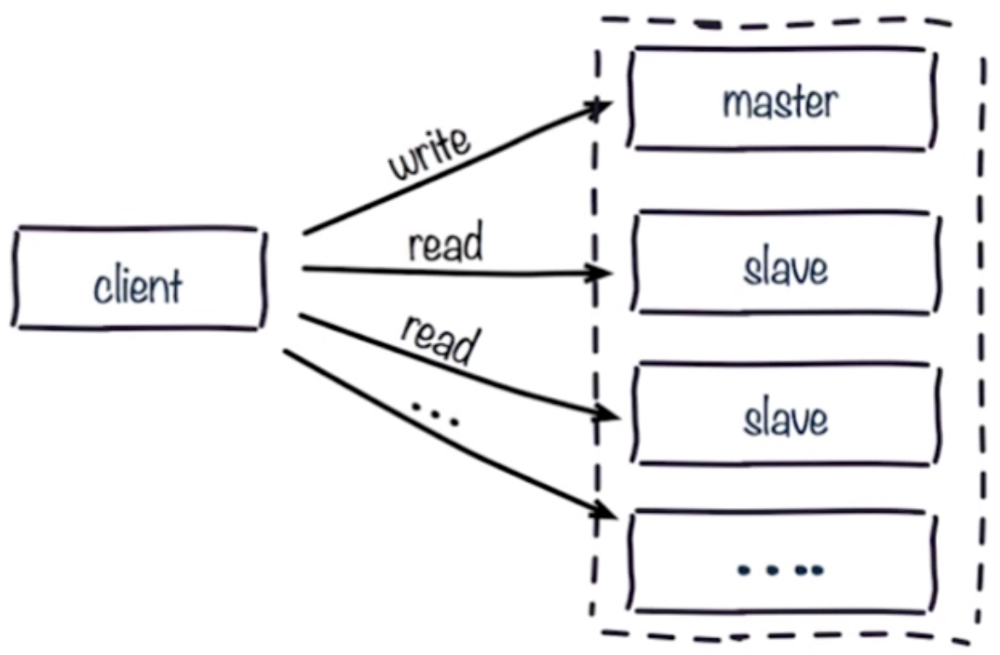

[TOC]

# 一. 配置主从概述
**主从复制(Replication)**：也叫`主从同步`，它是将Redis**主服务器**的数据同步到任意数量的**从服务器**上，同步使用的是`发布/订阅机制`。Redis的`持久化功能`，只能保障在宕机等情况下恢复大部分数据 ，但在`硬盘故障`、`系统崩溃`等`单点故障`情况下，仍可能引发灾难性后果。而主从复制可以更好的解决这一问题，达到`故障转移`的目的。
```shell
Redis通过`持久化`、`主从复制`、`哨兵模式`、`集群`保证了数据是安全和服务的高可用性。
```

<br/>

# 二. 配置主从复制
```shell
Master  127.0.0.1:6379
Slave1  127.0.0.1:6380
Slave2  127.0.0.1:6381
```
**1. 创建服务：**
```shell
cd /usr/local/redis && mkdir pid && mkdir logs && mkdir data
```
- 创建`6379.conf`,`6380.conf`,`6381.conf`三个配置文件,如`./conf/6379.conf`:
```conf
port 6379
daemonize yes
dir "/usr/local/redis/data"
pidfile "/usr/local/redis/pid/6379.pid"
logfile "/usr/local/redis/logs/6379.log"
dbfilename "dump_6379.rdb"
appendfilename "dump_6379.aof"
```
```shell
sed "s/6379/6380/g" ./conf/6379.conf>./conf/6380.conf
sed "s/6379/6381/g" ./conf/6379.conf>./conf/6381.conf
```

**2. 启动服务**
```shell
redis-server ./conf/6379.conf
redis-server ./conf/6380.conf
redis-server ./conf/6381.conf
```
```shell
ps -ef | grep redis-server 
```
·
**3. 实现复制**
**方式一 . 命令方式** 
```shell
# 将6379作为Master
redis-cli -p 6380 slaveof 127.0.0.1 6379
redis-cli -p 6381 slaveof 127.0.0.1 6379 
```

**方式二 . 配置方式**（只需修改从服务）, 需要重启服务。
```shell
replicaof 127.0.0.1 6379  
replica-serve-stale-data yes
replica-read-only yes   
replica-priority 100
replica-lazy-flush no
client-output-buffer-limit replica 256mb 64mb 60
```


**4. 验证服务：**
```shell
redis-cli -p 6379 info replication
redis-cli -p 6380 info replication
redis-cli -p 6381 info replication

redis-cli -p 6379 set hello world
redis-cli -p 6380 get hello
redis-cli -p 6381 get hello
```

**5. 关闭从服务：**
```shell
redis-cli -p 6380 slaveof no one

redis-cli -p 6379 set hello redis
redis-cli -p 6380 get hello  #观察到该服务已脱离复制
redis-cli -p 6381 get hello
```
<br/>

# 三. 配置主从原理
```shell
$ redis-cli info server | grep run_id       #查看服务ID
$ redis-cli info replication | grep offset  #复制偏移量
```
## 1. 全量复制
**1.1 复制过程：** 在出现`网络抖动`或`服务重启`(服务ID改变)时，会引发全量复制。复制过程如下：
- 第1步：slave向master发送psync（`runid`为问号，偏移量为`-1`）；
- 第2步：master根据`runid`和`offset`判断要做全量复制，并向slave发送`FullResync(runid,offset)`数据；
- 第3步：slave保存master信息；
- 第4步：master保存全量复制到快照，同时将增量数据保存到`buffer`；
- 第5步：master向slave发送`RDB`数据；
- 第6步：master发送`send buffer`数据；
- 第7步：slave删除老数据；
- 第8步：slave加载新的`RDB`；




**1.2 复制开销：**
- bgsave时间
- RDB文件网络传输时间
- 从节点清空数据时间
- 从节点加载RDB文件时间
- 可能的AOF重写时间

## 2. 部分复制
**2.1 复制原理：** Redis2.8+提供部分复制，即复制断开后会`发送缓冲`(默认1M)，**如果偏移量大于`1M`，则进行全量复制**。




<br/>

# 四. 配置主从问题

- 单个服务实例是故障可能是个小概率事件，但当服务的规模达到一定数量的时候，故障的产生就变成一个必然问题。

## 1. 读写分离



Replication除了数据备份(数据安全），另外一个重要的应用就是读写分离。读写分离可以提升系统性能，但也增加了系统的复杂性

- **1. 复制数据延迟：** 由于网络延迟或程序阻塞，出现主从数据不一致，可判断数量偏移量，进行数据回溯查询，但这大大增加了复杂性。
- **2. 读到过期数据 :** 由于对Slave的过期数据采取`懒惰删除`或`定时任务`进行删除，难免出现读到过期数据。新版本(v3.2+)已经解决了该问题。
- **3. 从节点故障：** 优先优化主节点，其次可使用哨兵模式、集群等方案。

## 2. 主从配置不一致
- **1. Maxmemery不一致：**，master和slave内存大小设置不一致，在主从切换等情况下导致丢失数据，建议使用标准安装工具，对数据进行监控和校验。
- **2. 数据结构优化参数(hash-max-ziplist-entries)：**主从设置不一致而导致的不可预知的问题。

## 3. 规避全量复制
- **1. 第一次全量复制：** 无法避免，可才低峰(如晚上)进行，其次可使用小主节点（切片）减少全量复制的性能损耗。
- **2. 节点运行ID不匹配：** 主节点重启(运行ID变化)，可使用故障转移，将slave晋升为master，如哨兵或集群。
- **3. 复制积压缓冲区不足：** 如网络中断，缓冲区不足1M，导致的全量复制，可调整`rel_backlog_size` 参数。

## 4.规避复制风暴
- **1. 单主机复制风暴：** 即主节点重启，多从节点复制。可调整`复制拓扑`,如`"master->slave->slave"`。
- **2. 单机器复制风暴：** 即一台主机有多个redis实例，在机器重启后，导致大量全量复制。可将节点分散到多机器，当然也可以使用`高可用`。


<br/>

> 参考：
http://www.redis.com.cn/topics/replication
https://www.cnblogs.com/wdliu/p/9407179.html

