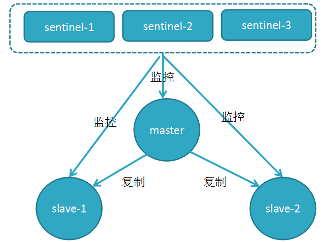

[TOC]

# 一. 哨兵模式概述
1. Redis-Sentinel是官方推荐的**高可用性(HA)解决方案**;
2. Redis-Sentinel中的sentinel可用**集群**方式解决单点问题；
3. 哨兵是一种特殊的Redis服务，`只能用作redis实例监控`;
4. 哨兵的三个任务是：**监控服务**，**发送通知**和**故障转移**;



<br/>
查看源图像


**哨兵常用命令：**
redis-cli -p 26379 sentinel help
```shell
# 重置名字匹配正则表达式的所有master状态信息，清除之前存储的状态信息和slaves信息。PS：节点只要加入过sentinel，信息就会保存而不会自动清除  
sentinel reset <pattern>

# 用于改变关于master的配置，例如 sentinel set mymaster down-after-milliseconds 1000 ,此命令修改了当节点第一次失去连接到判定其下线所经过的时间
sentinel set <name> <option> <value>

# 告诉sentinel去监听新的master 
sentinel monitor <name> <ip> <port> <quorum>  

# 命令sentinel放弃对某个master的监听
sentinel remove <name>  

# 这个参数设置集群从判断节点挂掉，到执行failover操作（即重新选举master节点）的时间
sentinel failover-timeout mymaster 10000
```

<br/>

# 二. 搭建哨兵模式
## 2.1 创建主从实例
> 创建`6379`(master)，`6380`(slave-1)和`6381`(slave-2)三个Redis测试实例，可参考：https://blog.csdn.net/Gusand/article/details/104249393
## 2.2 创建哨兵集群
### a. 配置哨兵
*创建如下三个哨兵 [配置文件](https://raw.githubusercontent.com/redis/redis/6.0/sentinel.conf) `26379.conf`、`26380.conf` 和 `26381.conf` :*
```shell
# Sentinel 26379.conf
port 26379
daemonize yes
pidfile /var/run/26379.pid
logfile /var/log/redis_26379.log

# 配置握手信息
# sentinel monitor mymaster 127.0.0.1 6379 2
```
```shell
# 生成副本
sed "s/26379/26380/g" 26379.conf > 26380.conf
sed "s/26379/26381/g" 26379.conf > 26381.conf
```
### b. 启动服务
```shell
redis-server ./26379.conf --sentinel
redis-server ./26380.conf --sentinel
redis-server ./26381.conf --sentinel

# 查看主从和哨兵进程
ps -ef |grep redis
root        1494       1  0 14:44 ?        00:00:28 redis-server 127.0.0.1:6379
root        1173       1  0 11:49 ?        00:00:59 redis-server 127.0.0.1:6380
root        1179       1  0 11:49 ?        00:01:00 redis-server 127.0.0.1:6381
root        1534       1  0 14:53 ?        00:01:07 redis-server *:26379 [sentinel]
root        1536       1  0 14:53 ?        00:01:07 redis-server *:26380 [sentinel]
root        1546       1  0 14:53 ?        00:01:04 redis-server *:26381 [sentinel]
```
### c. 哨兵握手
>  ⚠️ 握手，即所有哨兵都去监听`master`（如果在配置文件中添加了握手信息，则可忽略该项，服务在启动过程中会完成握手）。
```shell
redis-cli -p 26379 sentinel monitor mymaster 127.0.0.1 6379 2
redis-cli -p 26379 sentinel monitor mymaster 127.0.0.1 6379 2
redis-cli -p 26379 sentinel monitor mymaster 127.0.0.1 6379 2
```
*查看任意Sentinel配置文件，会发现系统会`REWRITE`握手配置：*
```shell
# Generated by CONFIG REWRITE
protected-mode no
user default on nopass ~* &* +@all
dir "/home/shs"
sentinel myid 248c929ab094f013c8e0d32a8e75f4f64097a8ec
sentinel current-epoch 1
sentinel monitor mymaster 127.0.0.1 6379 2
sentinel config-epoch mymaster 1
sentinel leader-epoch mymaster 1

sentinel known-sentinel mymaster 127.0.0.1 26380 7564f614d6a95d8c5b12ce9f6d18f8e730a87b5f
sentinel known-sentinel mymaster 127.0.0.1 26381 2eb7e2925f06cdc8cf5186217ffa887d2a2ec55f
```

### d.  查看状态
```shell
redis-cli -p 26379 sentinel masters                           # 查看所有master
redis-cli -p 26379 info sentinel                              # 查看哨兵信息  
redis-cli -p 26379 sentinel get-master-addr-by-name mymaster  # 查看msater主机

redis-cli -p 26379 sentinel master mymaster        # 查看master
redis-cli -p 26379 sentinel slaves mymaster        # 查看slaves
redis-cli -p 26379 sentinel sentinels mymaster     # 查看其他哨兵
```

# 三. 哨兵模式配置
```shell
# Example sentinel.conf

# 默认为保护模式(protected-mode yes),即只能通过localhost访问Redis-Server；
# 可绑定IP或禁用保护模式，且保证防火墙不受限的情况下，供外部访问
# protected-mode no
bind 127.0.0.1 192.168.1.1
port 26379

# 设定为守护进程，并设置PID路径
daemonize yes
pidfile /var/run/redis-sentinel.pid

# 设置日志文件路径，如果为空且为守护模式，则日志将被输出到/dev/null
logfile ""

# 用于在NAT网络中公布IP或Port，而非自动检测本地地址
#
# sentinel announce-ip <ip>
# sentinel announce-port <port>
# 工作目录，Sentinel中(由于无核心业务数据输出)建议输出为/tmp
dir /tmp

# 监控master
# sentinel monitor <master-name> <ip> <redis-port> <quorum>
sentinel monitor mymaster 127.0.0.1 6379 2


# 设置master和slave的密码，且密码必须相同
sentinel auth-pass <master-name> <password>

# Redis6.0或更高版本中，对ACL功能的实例进行身份验证
sentinel auth-user <master-name> <username>

#设定Sentinel自身密码，同一组Sentinel中的密码必须相同
requirepass <password>

# 如果在30秒内连续不能PING成功(心跳检测)，可视为主观下线(S_DOWN)
sentinel down-after-milliseconds mymaster 30000

# 在故障转移期间，我们可以重新配置多少副本以同时指向新副本。
sentinel parallel-syncs mymaster 1

# 故障转移超时时间
# sentinel failover-timeout <master-name> <milliseconds>
sentinel failover-timeout mymaster 180000

# 在发生-sdown、-odown时，通过电子邮件、短信等方式通知系统管理员。
# 该脚本仅使用两个参数调用：第一个是事件类型，第二个是事件描述。
# 如果提供此选项，脚本必须存在且可执行，以便哨兵启动。
sentinel notification-script mymaster /var/redis/notify.sh

# 客户端重新配置脚本，当主服务器因故障转移而更改时，可以调用脚本以执行特定于应用程序的任务，
# 以通知客户端配置已更改且主服务器位于不同的地址。
sentinel client-reconfig-script mymaster /var/redis/reconfig.sh

sentinel deny-scripts-reconfig yes

# REDIS COMMANDS RENAMING
# SENTINEL rename-command mymaster CONFIG CONFIG
```
# 四. 哨兵常用命令


# 五. 故障转移原理
**模拟故障转移**
```shell
# 关闭master服务，观察服务转移变化
redis-cli -p 6379 shutdown

$ tail -3 ./logs/6379.log
61496:M 16 Jun 2020 14:24:46.627 # User requested shutdown...
61496:M 16 Jun 2020 14:24:46.628 * Removing the pid file.
61496:M 16 Jun 2020 14:24:46.630 # Redis is now ready to exit, bye bye...

$ tail -5 ./logs/26379.log
62175:X 16 Jun 2020 14:25:18.327 # +failover-end master mymaster 127.0.0.1 6379
62175:X 16 Jun 2020 14:25:18.327 # +switch-master mymaster 127.0.0.1 6379 127.0.0.1 6381
62175:X 16 Jun 2020 14:25:18.329 * +slave slave 127.0.0.1:6380 127.0.0.1 6380 @ mymaster 127.0.0.1 6381
62175:X 16 Jun 2020 14:25:18.330 * +slave slave 127.0.0.1:6379 127.0.0.1 6379 @ mymaster 127.0.0.1 6381
62175:X 16 Jun 2020 14:25:48.342 # +sdown slave 127.0.0.1:6379 127.0.0.1 6379 @ mymaster 127.0.0.1 6381
```

<br/>

> 参考：
> https://www.jianshu.com/p/06ab9daf921d
> https://www.jianshu.com/p/231afa35d937
> https://blog.csdn.net/sunbocong/article/details/85252071
https://segmentfault.com/a/1190000002680804


https://zhangweisep.github.io/2018/09/26/Redis%E5%93%A8%E5%85%B5%E6%A8%A1%E5%BC%8F%E5%92%8C%E9%9B%86%E7%BE%A4%E6%90%AD%E5%BB%BA/


