[TOC]

# 一. 数据概要
集群主要解决了单机的`网络`、`容量`、`CPU`瓶颈问题，也就是解决了水平扩展的问题。

## 1.1 集群架构

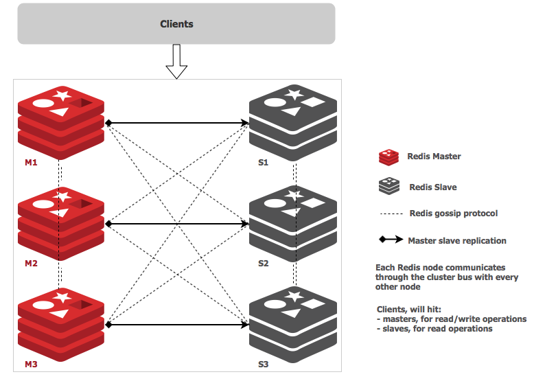

## 1.2 集群分布
| 分布方式 | 特点       | 典型产品 |
| -------- | ----------------- | --------------------- |
| 顺序分布 | 数据容易倾斜<br/>可顺序访问<br/>支持批量操作 | BitTable<br/>HBase   |
| 哈希分布 | 离散度高<br/>无法顺序访问<br/>支持批量操作   | 一致性哈希Memcache<br/>Redis Cluster |
*顺序分布略过；哈希分布可分为`节点取模`，`一致性哈希`和`虚拟槽`三种方式。*

### a. 节点取模:
- 哈希取余，数据漂移量大，不好做伸缩，所以建议`翻倍扩容`。

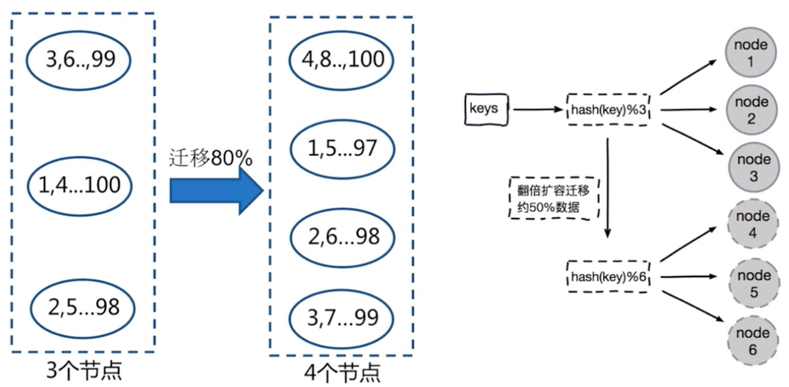

### b. 一致性哈希

- 哈希顺时针节点取余，之影响相邻节点，可减小数据迁移成本。「建议翻倍扩容？」

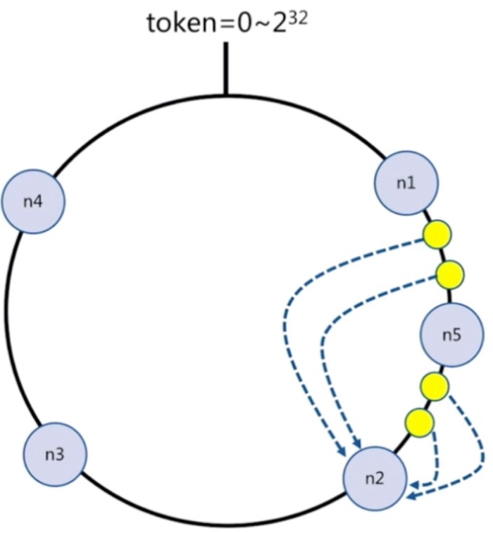


### c. 虚拟槽
-  每个槽管理一个数据子集，采用良好的哈希算法`CRC16`。

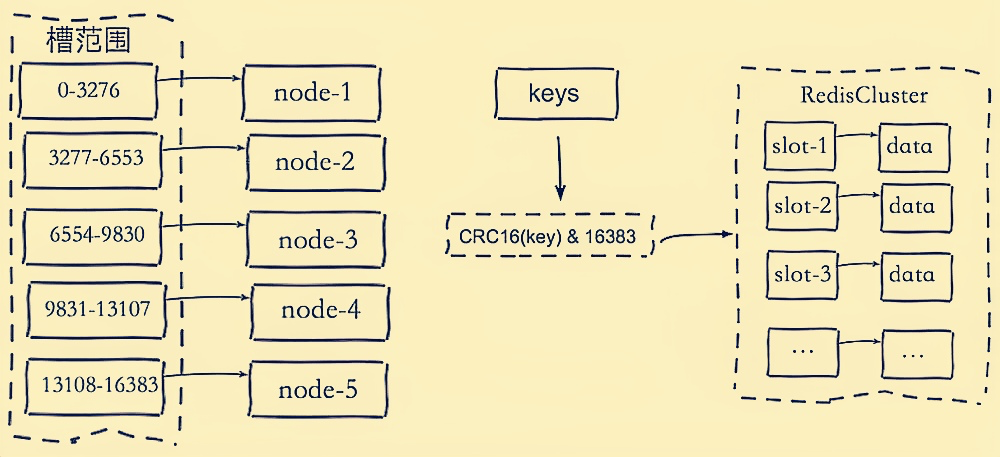


<br/>

# 二. Redis集群搭建
- Redsi集群实例有两个端口,如6379(`服务端口`)和16379(`总线端口`)，偏移量总为`10000`；
- Redis集群创建流程： `创建节点` =>  `Meet` => `指派槽` => `赋值`；
- Redis集群最多可划分`16384`个槽，客户端与槽的映射关系是 `slot=CRC16(key)%16383`；

## 2.1 创建节点服务
**创建配置文件：** 创建`7000`,`7001`,`7002`,`7003`,`7004`,`7005`节点配置文件
```shell
# Redis 7000.conf

# 绑定内网与外网
bind 127.0.0.1 10.0.0.11
port 7000
daemonize yes

# 主要路径：dir、dbfilename、logfile、pidfile、cluster-config
# dir指定dbfile目录，其余为具体路径
dir /usr/local/redis/data
dbfilename dump_7000.rdb
logfile /usr/local/redis/logs/redis_7000.log
pidfile /var/run/redis_7000.pid
cluster-config-file /usr/local/redis/conf/node_7000.conf

# cluster-require-full-coverage: 全部通过才故障转移
# cluster-config-file: 自动维护,记录集群动态配置信息
cluster-enabled yes
cluster-require-full-coverage no
```
```shell
# 生成副本
sed "s/7000/7001/g" ./7000.conf > 7001.conf
sed "s/7000/7002/g" ./7000.conf > 7002.conf
sed "s/7000/7003/g" ./7000.conf > 7003.conf
sed "s/7000/7004/g" ./7000.conf > 7004.conf
sed "s/7000/7005/g" ./7000.conf > 7005.conf
```
**启动服务：**
```shell
redis-server ./7000.conf
redis-server ./7001.conf
redis-server ./7002.conf
redis-server ./7003.conf
redis-server ./7004.conf
redis-server ./7005.conf
```
**查看服务**：每个节点实例，都开启了两个端口，一个用于提供服务，一个用于集群通信。
```shell
[root@shs conf]# ps -ef|grep redis
root       1185      1  0 14:47 ?        00:00:02 redis-server *:7000 [cluster]
root       1191      1  0 14:47 ?        00:00:02 redis-server *:7001 [cluster]
root       1197      1  0 14:47 ?        00:00:02 redis-server *:7002 [cluster]
root       1203      1  0 14:47 ?        00:00:02 redis-server *:7003 [cluster]
root       1205      1  0 14:47 ?        00:00:02 redis-server *:7004 [cluster]
root       1215      1  0 14:47 ?        00:00:02 redis-server *:7005 [cluster]
[root@shs conf]# netstat -ntlp4|grep 700
tcp        0      0 0.0.0.0:7000            0.0.0.0:*               LISTEN      1185/redis-server *
tcp        0      0 0.0.0.0:7001            0.0.0.0:*               LISTEN      1191/redis-server *
tcp        0      0 0.0.0.0:7002            0.0.0.0:*               LISTEN      1197/redis-server *
tcp        0      0 0.0.0.0:7003            0.0.0.0:*               LISTEN      1203/redis-server *
tcp        0      0 0.0.0.0:7004            0.0.0.0:*               LISTEN      1205/redis-server *
tcp        0      0 0.0.0.0:7005            0.0.0.0:*               LISTEN      1215/redis-server *
tcp        0      0 0.0.0.0:17000           0.0.0.0:*               LISTEN      1185/redis-server *
tcp        0      0 0.0.0.0:17001           0.0.0.0:*               LISTEN      1191/redis-server *
tcp        0      0 0.0.0.0:17002           0.0.0.0:*               LISTEN      1197/redis-server *
tcp        0      0 0.0.0.0:17003           0.0.0.0:*               LISTEN      1203/redis-server *
tcp        0      0 0.0.0.0:17004           0.0.0.0:*               LISTEN      1205/redis-server *
tcp        0      0 0.0.0.0:17005           0.0.0.0:*               LISTEN      1215/redis-server *
```

## 2.2  手动配置集群
**a. 节点握手: ** 命令：`CLUSTER MEET <ip> <port> [<bus-port>]`
```shell
redis-cli -p 7000 cluster meet 127.0.0.1 7001
redis-cli -p 7000 cluster meet 127.0.0.1 7002
redis-cli -p 7000 cluster meet 127.0.0.1 7003
redis-cli -p 7000 cluster meet 127.0.0.1 7004
redis-cli -p 7000 cluster meet 127.0.0.1 7005
```
**b. 设置主从: ** 命令：`CLUSTER REPLICATE <node-id>`
```shell
redis-cli -p 7003 cluster replicate <MASTER0-ID>
redis-cli -p 7004 cluster replicate <MASTER1-ID>
redis-cli -p 7005 cluster replicate <MASTER2-ID>
```
**c. 分配Slot: **  命令：`CLUSTER ADDSLOTS <slot> [<slot> ...] `
```shell
#!/bin/bash
# 分配Slot脚本，命令：./slot -p 700x <start> <end>
for slot in `seq $2 $3`
do
  echo "slot - ${slot}"
  redis-cli -p $1 cluster addslots ${slot}
done
```
```shell
# 执行自动化脚本
./slot 7000 0     5461
./slot 7001 5462  10922
./slot 7002 10923 16383
```
## 2.3 工具配置集群
> 使用`redis-cli --cluster`命令，可快速进行集群服务配置与管理，`redis-cli --cluster help`查看命令帮助
```shell
# 须停止服务，并删除原集群节点配置文件cluster-config-file
# --cluster-replicas 1表示为每个master指定一个slave
$ redis-cli --cluster create --cluster-replicas 1 \
127.0.0.1:7000 127.0.0.1:7001 \
127.0.0.1:7002 127.0.0.1:7003 \
127.0.0.1:7004 127.0.0.1:7005 

>>> Performing hash slots allocation on 6 nodes...
Master[0] -> Slots 0 - 5460                                     # 自动分配槽
Master[1] -> Slots 5461 - 10922
Master[2] -> Slots 10923 - 16383
Adding replica 127.0.0.1:7004 to 127.0.0.1:7000                 # 自动主从配置
Adding replica 127.0.0.1:7005 to 127.0.0.1:7001
Adding replica 127.0.0.1:7003 to 127.0.0.1:7002
>>> Trying to optimize slaves allocation for anti-affinity
[WARNING] Some slaves are in the same host as their master
M: ead9c8fabcb56f380725282f35c400746417d482 127.0.0.1:7000
   slots:[0-5460] (5461 slots) master
M: 2db1f1586ef48dddb016f0fa8ea0eba7989c49a2 127.0.0.1:7001
   slots:[5461-10922] (5462 slots) master
M: 45f4b6f7296fd7bed4d9aff1dfd036c96a6f263e 127.0.0.1:7002
   slots:[10923-16383] (5461 slots) master
S: 47e6ddd4bad4d50eb0819634dc6932d1da37cc06 127.0.0.1:7003
   replicates 2db1f1586ef48dddb016f0fa8ea0eba7989c49a2
S: 830cb8763758305150c4576d65caed67c7dcb9a8 127.0.0.1:7004
   replicates 45f4b6f7296fd7bed4d9aff1dfd036c96a6f263e
S: aac62e97aa06dd3967f36dc30ebd33f2b312e284 127.0.0.1:7005
   replicates ead9c8fabcb56f380725282f35c400746417d482
Can I set the above configuration? (type 'yes' to accept): yes  # 接受更新配置
>>> Nodes configuration updated
>>> Assign a different config epoch to each node
>>> Sending CLUSTER MEET messages to join the cluster
Waiting for the cluster to join

>>> Performing Cluster Check (using node 127.0.0.1:7000)
M: ead9c8fabcb56f380725282f35c400746417d482 127.0.0.1:7000
   slots:[0-5460] (5461 slots) master
   1 additional replica(s)
S: 47e6ddd4bad4d50eb0819634dc6932d1da37cc06 127.0.0.1:7003
   slots: (0 slots) slave
   replicates 2db1f1586ef48dddb016f0fa8ea0eba7989c49a2
M: 2db1f1586ef48dddb016f0fa8ea0eba7989c49a2 127.0.0.1:7001
   slots:[5461-10922] (5462 slots) master
   1 additional replica(s)
S: 830cb8763758305150c4576d65caed67c7dcb9a8 127.0.0.1:7004
   slots: (0 slots) slave
   replicates 45f4b6f7296fd7bed4d9aff1dfd036c96a6f263e
M: 45f4b6f7296fd7bed4d9aff1dfd036c96a6f263e 127.0.0.1:7002
   slots:[10923-16383] (5461 slots) master
   1 additional replica(s)
S: aac62e97aa06dd3967f36dc30ebd33f2b312e284 127.0.0.1:7005
   slots: (0 slots) slave
   replicates ead9c8fabcb56f380725282f35c400746417d482
[OK] All nodes agree about slots configuration.
>>> Check for open slots...                                     # 检查槽
>>> Check slots coverage...       
[OK] All 16384 slots covered.
```
## 2.4 测试集群服务
```shell
redis-cli -p 7000 cluster info     # 查看集群信息
redis-cli -p 7000 cluster nodes    # 参考集群节点

redis-cli --cluster info 127.0.0.1:7000
redis-cli --cluster fix 127.0.0.1:7000
redis-cli --cluster check 127.0.0.1:7000
```
```shell
redis-cli -p 7000  set k1001 v1001       # 单机方式写入(有可能转移，因为集群为每个Key设置了固定的Slot)
redis-cli -p 7000 -c set k1002 v10002    # 集群方式写入
```
```shell
# 查看集群数据大小
redis-cli -p 7000 dbsize
redis-cli -p 7001 dbsize
redis-cli -p 7002 dbsize
redis-cli -p 7003 dbsize
redis-cli -p 7004 dbsize
redis-cli -p 7005 dbsize

# 可以从任意一个主或从读到数据
redis-cli  -p 700x -c get k1001
redis-cli  -p 700x -c get k1002
```
# 三. Redis集群管理
## 3.1 添加节点
> **命令：** `add-node new_host:new_port existing_host:existing_port `，`existing`为已存在的任意集群实例。
```shell
redis-cli --cluster add-node 127.0.0.1:7006 127.0.0.1:7000                    # 增加Master节点
redis-cli --cluster add-node 127.0.0.1:7007 127.0.0.1:7006 --cluster-slave     # 增加Slave节点
```
## 3.2 删除节点
```shell
redis-cli --cluster del-node 127.0.0.1:7000 `<node-id>`
```
## 3.3  手动重新分配
> 命令： `redis-cli --cluster reshard 127.0.0.1:7000`
```shell
$ redis-cli --cluster info 127.0.0.1:7000    # 查看集群信息
$ redis-cli --cluster reshard 127.0.0.1:7000    #重新分配
>>> Performing Cluster Check (using node 127.0.0.1:7000)
M: 9ff753398e8fc944eb55743205a6aff0355b5378 127.0.0.1:7000
   slots:[0-5460] (5461 slots) master
...
[OK] All 16384 slots covered.
How many slots do you want to move (from 1 to 16384)? 20                # 要迁移多少个槽？
What is the receiving node ID? 8e987686f76ff4cf69ae8fb25e555c2c41befb8b # 要迁移到哪个节点上
Please enter all the source node IDs.
  Type 'all' to use all the nodes as source nodes for the hash slots.  # 将所有节点作为源节点
  Type 'done' once you entered all the source nodes IDs.               # 输入源节点ID后,键入“done”
Source node #1: all

Ready to move 20 slots.
  Source nodes:
    M: 9ff753398e8fc944eb55743205a6aff0355b5378 127.0.0.1:7000
       slots:[0-5460] (5461 slots) master
       1 additional replica(s)
       1 additional replica(s)
...
    Moving slot 10928 from e6ad95dffb2f8893ae952104b5cbc57b11629be6
Do you want to proceed with the proposed reshard plan (yes/no)? yes    # 是否继续执行计划
...
```
## 3.4 脚本重新分配
> 命令：`redis-cli --cluster reshard <host>:<port> --cluster-from <node-id> --cluster-to <node-id> --cluster-slots <number of slots> --cluster-yes`
```shell
# -cluster-yes：命令的提示回答“是”， 也可以设置为REDISCLI_CLUSTER_YES 环境变量
# reshard <host>:<port> --cluster-from <node-id> --cluster-to <node-id> --cluster-slots <number of slots> --cluster-yes
redis-cli --cluster reshard 127.0.0.1:7000 --cluster-from all --cluster-to 8e987686f76ff4cf69ae8fb25e555c2c41befb8b --cluster-slots 50 --cluster-yes
```

## 3.5 迁移副本

## 3.6 升级节点

## 3.7 故障转移
```shell
# 1. 准备在源节点导出槽
cluster setslot {slot} importing {sourceNodeID}

# 2. 准备向目标节点迁移槽
cluster setslot {slot} migrating {targetNodeID}

# 3. 循环
```

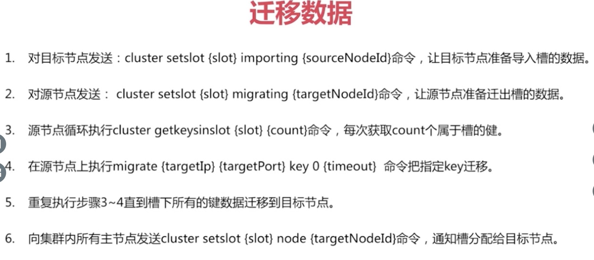

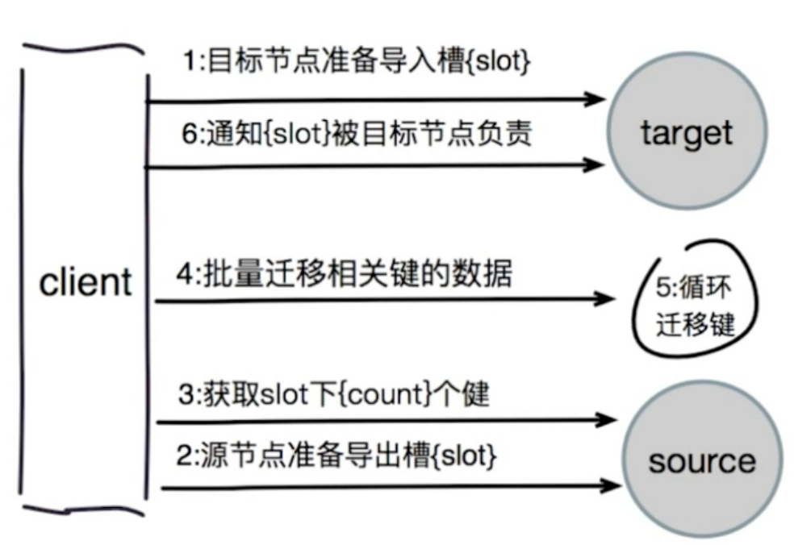


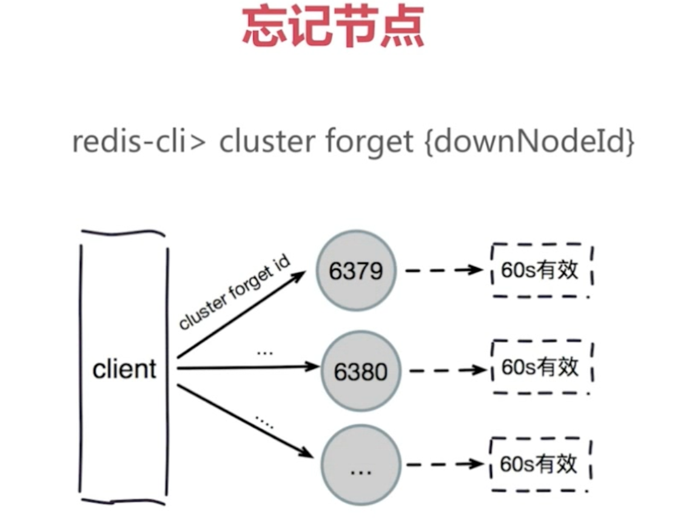


```shell
# 计算Key在哪个槽中
redis-cli -p 7000 cluster keyslot hello
```

# 四. 客户端路由
## 4.1 Moved重定向

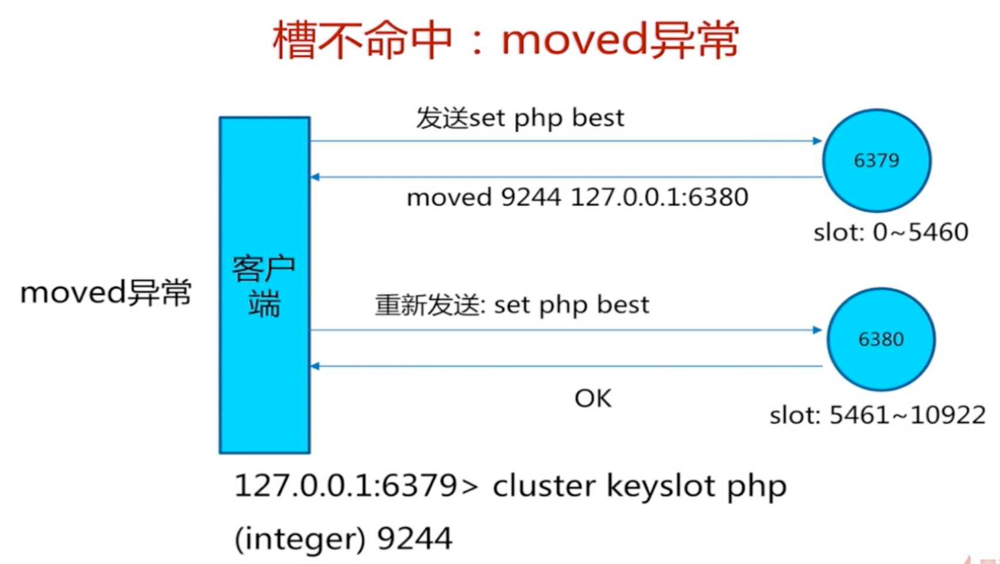

## 4.2 Ask重定向

## 4.3 Smart重定向

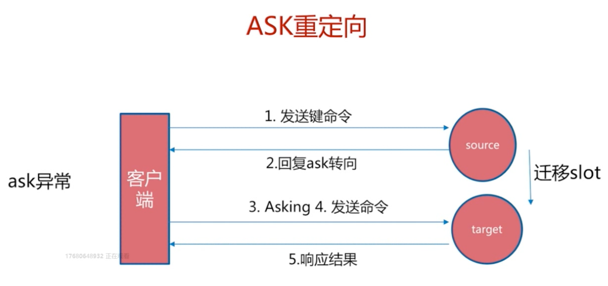


# 七. 集群原理

# 八. 常见问题

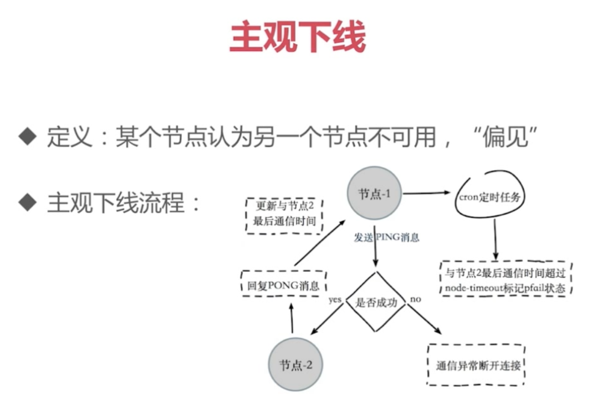

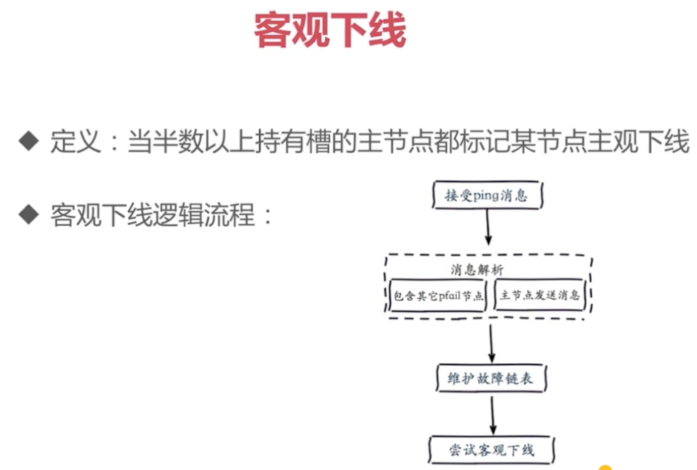

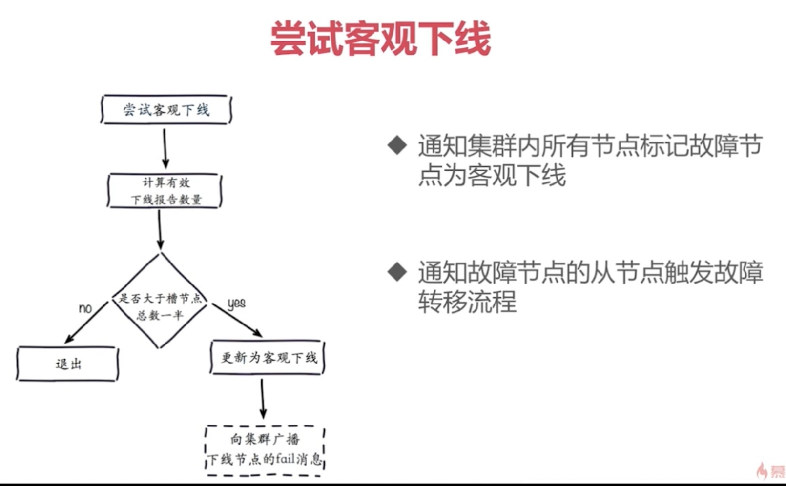


# 总结
```yaml
集群引入：
    解决了单机「网络」、「容量」和「CPU」瓶颈，即实现了Redis的水平扩展。

集群架构：
    1. 集群是一个完整的连通图
    2. 节点之间通过Gossip协议进行通信
    3. 集群之间通过总线接口访问，Node_Port=Instance_Port + 10000_
    master -> slave
    master -> slave
    master -> slave

集群分布：
    1. 顺序结构：数据容易倾斜，可以批量操作，如BitTabale、HBase；
    2. 哈希结构：离散度高，无法顺序访问，如：Memcache、Redis集群；
        a: 节点取模：数据飘移量大，建议多倍扩容；
        b: 一致性哈希：只会影响相邻节点的数据，建议多倍扩容；
        c: 哈希槽(slot): 共16384个槽，每个槽管理一个数据子集，采用CRC16哈希算法；

手动搭建：
    1. 创建节点服务
      a. 配置集群
        port 7000
        dir ./
        logfile /var/log/redis_7000.log
        pidfile /var/run/redis_7000.pid
        dbfilename dump_7000.rdb

        cluster-enabled yes
        cluster-require-full-coverage no
        cluster-config-file nodes_7000.log

         sed "s/7000/7001/g" ./7000.conf > 7001.conf
         sed "s/7000/7002/g" ./7000.conf > 7002.conf
         sed "s/7000/7003/g" ./7000.conf > 7003.conf
         sed "s/7000/7004/g" ./7000.conf > 7004.conf
         sed "s/7000/7005/g" ./7000.conf > 7005.conf
      b. 启动服务：
        redis-server ./7000.conf
        redis-server ./7001.conf
        redis-server ./7002.conf
        redis-server ./7003.conf
        redis-server ./7004.conf
        redis-server ./7005.conf
         查看服务
        ps -ef|grep redis
        netstat -ntpl4|grep 700
    2. 节点握手
       redis-cli -p 7000 cluster meet <OTHER-IP> <PORT>
    3. 设置节点主从
       redis-cli -p 7003 cluster replicate <MASTER-NODE-ID>
    4. 分配槽(需要将16384个槽分配完)
       redis-cli -p 7000 cluster addslots <0-16383> [SLOT...]

工具搭建
    使用cluster工具命令，它是一个Redis集群工具命令集合，区别于服务命令中的cluster。
    1. 创建集群
        redis-cli --cluster help    #查看帮助
        redis-cli --cluster create --cluster-replicas 1 <ip:port> [ip:port...]  #自动完成分配槽、设置主从、写入配置、发送握手和检查操作；
    2. 查看集群
        redis-cli --cluster info 127.0.0.1:7000
        redis-cli --cluster fix 127.0.0.1:7000
        redis-cli --cluster check 127.0.0.1:7000

    3. 添加节点
        redis-cli --cluster add-node 127.0.0.1:7008 127.0.0.1:7000  # 添加Master节点
        redis-cli --cluster add-node --cluster-slave
    4. 重新分配
        redis-cli --cluster reshard 127.0.0.1:7000   #在任意节点按提示执行(将「多少」个槽从「源节点」分配到「目标节点」)
    5. 删除节点
        redis-cli --cluster del-node 127.0.0.1:7000 <NODE-ID> #从任意节点删除一个集群成员


# ⚠️   集群工具命令弱化了主机属性，主机只是命令的一个参数项！
```

https://redis.io/topics/cluster-tutorial/
https://www.cnblogs.com/cjsblog/p/9048545.html


