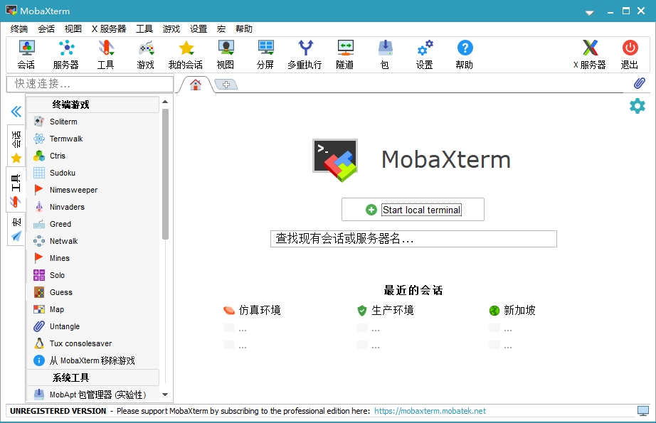
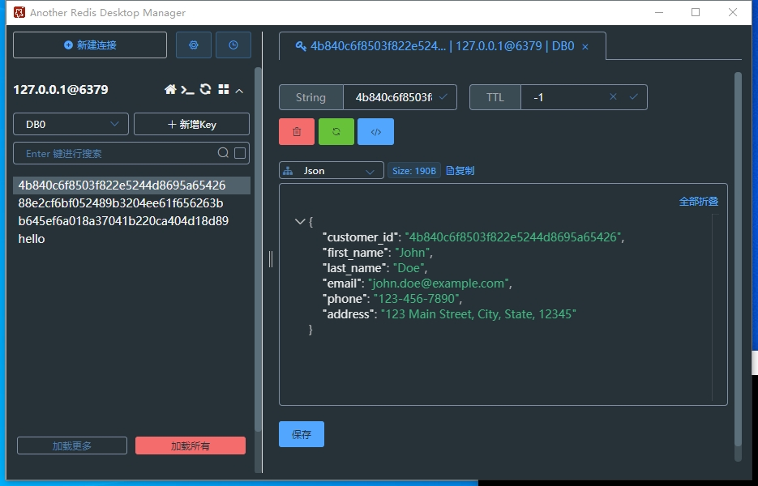
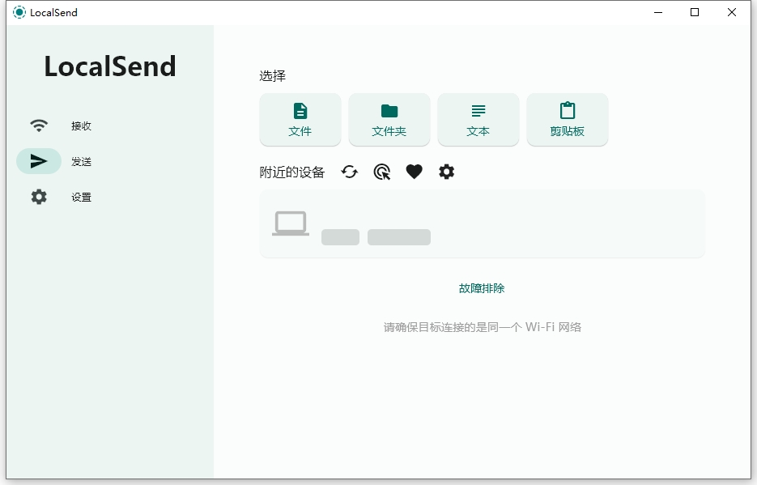
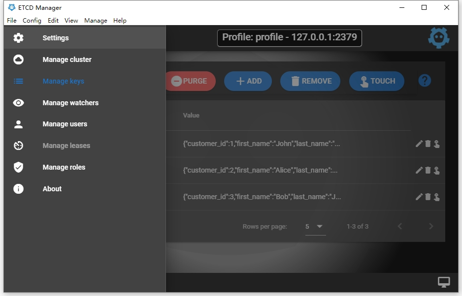

## MobaXterm

> [**MobaXterm**](https://github.com/RipplePiam/MobaXterm-Chinese-Simplified)是一款增强版的Windows终端，具备X11服务器、选项卡式SSH客户端、网络工具等众多功能。

## RedisManager

> [**Another Redis Desktop Manager**](https://github.com/qishibo/AnotherRedisDesktopManager/) 是一款优秀Redis桌面(GUI)管理客户端

## LocalSend

> [**LocalSend**](https://localsend.org) 是一个**跨平台**的文件收发工具

## EtcdManager

> [**EtcdManager**](https://etcdmanager.io/) 是一个免费的、跨平台的[ETCD](http://www.etcd.io)  v3 客户端和GUI。

