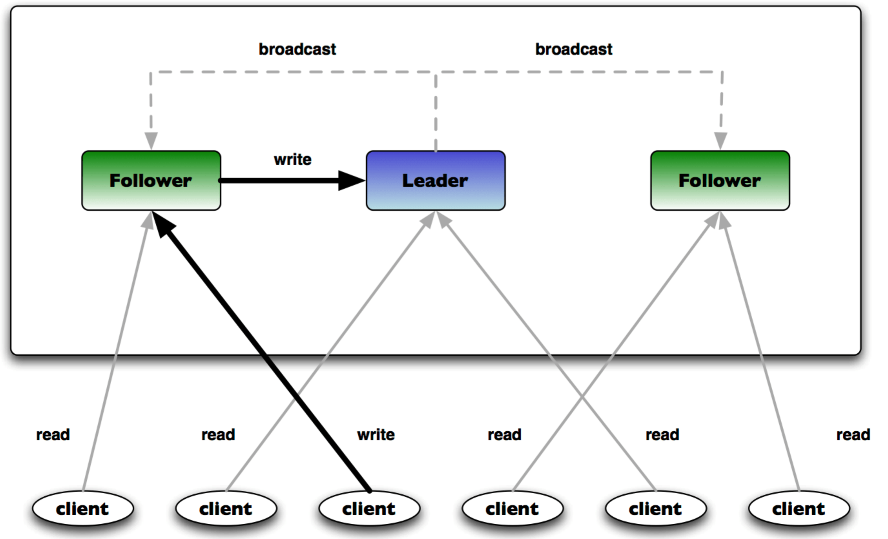

## Zookeeper集群



## 服务管理

### Docker网络

```shell
# 全部存在名为docker_net(自定义)的docker网络
$ docker network ls|grep docker_net
b594f8d537f1   docker_net                             bridge    local

# 不存在时则创建该网络
$ docker network create docker_net
```


### 启动ZK集群

```shell
# 启动服务
$ docker-compose -f docker-compose-zookeeper-cluster.yml up -d

# 查看服务
$ docker-compose -f docker-compose-zookeeper-cluster.yml ps

# 更新配置
$ docker-compose -f docker-compose-zookeeper-cluster.yml build

# 停止服务
$ docker-compose -f docker-compose-zookeeper-cluster.yml stop

# 重启服务
$ docker-compose -f docker-compose-zookeeper-cluster.yml restart

# 删除服务
$ docker-compose -f docker-compose-zookeeper-cluster.yml down
```


## 集群验证

### 查看服务状态

```shell
# 查看配置信息
echo conf | nc 127.0.0.1 2181
echo conf | nc 127.0.0.1 2182
echo conf | nc 127.0.0.1 2183

# 查看集群状态
echo mntr | nc 127.0.0.1 2181|grep state
echo mntr | nc 127.0.0.1 2182|grep state
echo mntr | nc 127.0.0.1 2183|grep state

# 查看客户端列表
echo stat | nc 127.0.0.1 2181|grep Mode
echo stat | nc 127.0.0.1 2182|grep Mode
echo stat | nc 127.0.0.1 2183|grep Mode
```

_更多四字命令可参考https://blog.csdn.net/Gusand/article/details/104336646_


### 验证数据同步

```shell
# 在zoo1写入数据
$ docker exec -ti zoo1 zkCli.sh
> create /test "Hello World"

# 在zoo2、zoo3查看数据是否已同步
$ docker exec -ti zoo2 zkCli.sh
> get /test
```


### 模拟故障转移

```shell
# 停止zoo3(leader)服务
docker-compose -f docker-compose-zookeeper-cluster.yml stop zoo3

# 在此查看服务状态，是否重新选举出了leader
echo mntr | nc 127.0.0.1 2181|grep state
echo mntr | nc 127.0.0.1 2182|grep state
echo mntr | nc 127.0.0.1 2183|grep state

# 再次重启服务
docker-compose -f docker-compose-zookeeper-cluster.yml restart zoo3
```


### 扩展集群节点

要在一个已有的运行中的Zookeeper集群上动态添加一个Follower节点服务，可以按照以下步骤进行操作：

1. 在新节点上安装Zookeeper服务，并确保其版本与现有集群中的版本相同。

2. 修改新节点的Zookeeper配置文件`zoo.cfg`，以指定新节点要加入的集群。

   在`zoo.cfg`文件中，将以下属性设置为现有Zookeeper集群中某个节点的IP地址和端口号：

   ```
   server.id=host:port:port
   ```

   其中，`id`是新节点的唯一标识符，`host`是新节点的IP地址，`port`是新节点用于通信的端口。

   此外，将`server.x`设置为集群中现有节点的配置，其中`x`是现有节点的唯一标识符。例如：

   ```
   server.1=192.168.0.1:2888:3888
   server.2=192.168.0.2:2888:3888
   server.3=192.168.0.3:2888:3888
   ```

   在这里，`192.168.0.1`、`192.168.0.2`和`192.168.0.3`是现有节点的IP地址，`2888`是用于通信的端口，`3888`是用于选举的端口。请确保新节点的配置与现有节点的配置相同。

3. 启动新节点的Zookeeper服务，并等待它与现有集群中的其他节点建立连接。

   您可以使用`zkServer.sh status`命令检查新节点的状态，并确保它已经成功加入了集群。在新节点的日志文件中，您应该看到类似于以下消息：

   ```
   INFO [main-SendThread(192.168.0.1:2888)] zookeeper.ClientCnxn: Socket connection established to 192.168.0.1/192.168.0.1:2888, initiating session
   ```

4. 将新节点设置为Follower角色。

   在现有集群中的Leader节点上运行以下命令：

   ```
   echo addNode <new_node_id> <new_node_host>:<new_node_port> | nc localhost <leader_port>
   ```

   其中，`<new_node_id>`是新节点的唯一标识符，`<new_node_host>`和`<new_node_port>`是新节点的IP地址和端口号，`<leader_port>`是现有集群中Leader节点的通信端口。

   执行此命令后，Leader节点将向新节点发送同步数据的请求，并将其添加为Follower节点。

请注意，在向Zookeeper集群添加新节点时，需要确保新节点的Zookeeper版本与现有集群中的版本相同，否则可能会发生兼容性问题。此外，新节点应该具有足够的硬件资源来处理其分配的工作负载。


## 参考链接

https://zhuanlan.zhihu.com/p/110677319
https://blog.csdn.net/a1053765496/article/details/127877009

https://blog.csdn.net/Gusand/article/details/104336646