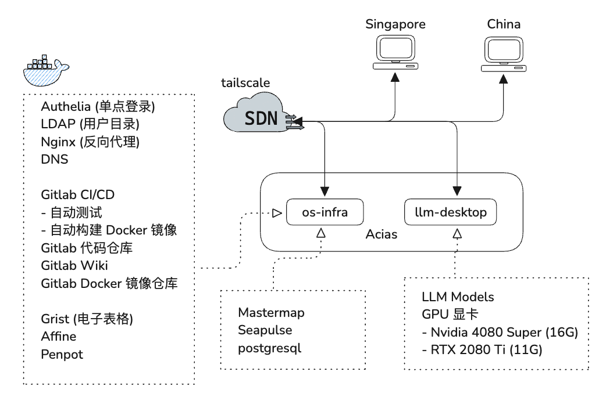

# 一. 后端开发规范

## 1.1 Py项目规范

**1. Python版本选择**

- 对于业务单一，性能要求低的项目，使用Python开发，Python版本**3.8~3.10**

**2. Python解释器**

- 生产环境使用PyPy解释器，提高性能

**3. Python应用打包**

- 推荐使用：Pyinstaller

**4. Python项目/虚拟环境工具**

- 统一使用UV工具

**5. 预提交钩子**

- 预提交钩子：参考：[Pre-Commit 入门指南.md](asset/Pre-Commit 入门指南.pdf)

**6. 科学计算辅助**

- 使用Streamlit库： 参考[Streamlit入门教程.md](asset/Streamlit入门教程.pdf)

编码规则 utf-8

换行符 lf

## Git提交规范

pre-commit

## 1.2 项目操作模板

**1. 功能需求模版 (Feature template)**

**Feature Name** : User Group Management

**Overview** : This feature allows administrators to manage user groups and assign 
permissions to control access to different parts of the system.

**Requirements** :
	1.Admin can edit user groups.
	2.Admin / Layer owner can assign layer permissions to user groups.
	3.Layer permission: **READ** / **WRITE**

**UI Design** :

**Implementation Proposal** :

**Timeline** 

**Actual Implementation** :功能需求流程 (Development process)

**2. 功能需求流程 (Development process)**

1. 设计 UI
2. 提出实施方案
3. 评估时间线
4. 提交表格
5. 写 test cases
6. 通过所有测试后，完成实现
7. 记录实际实现方案

**3. 问题报告模板 (Issue report template)**

**Bug Name** : Selected segment not highlighted on map

**Overview** :

1. Type “RT Crawford St to Spore Flyer” in the search bar,
2. Select “RT Crawford St to Spore Flyer” from drop-down list.

**Expected result**: The segement is highlighted on the map.

**Actual result**: The segement is not highlighted on the map.

**Attachments** :

**4. 问题报告流程 (Development process)**

1. 复刻问题
2. 分析预期与实际结果不符的原因
3. 写 test cases
4. 提出修复方案
5. 实际修复方案
6. 测试通过
7. 提交代码

**5. 发布流程 (Release Procedure)**

1. 申请合并代码
2. 自动化测试
3. 代码审核
4. 通过审核后，合并代码到主分支
5. 使用 Git 标签记录语义化版本，同时记录变更日志
6. 部署到生产环境

# 二. 项目协作工具

| 类别    | 工具名称          | 推荐理由（重点标注选择标准）                                 |
| -------- | ----------------- | ----------- |
| 产品设计              | Axure      | 首选，产品经理/研发须掌握 |
|       | Penpot       | 🚩备用/功能发掘 |
| 开发管理 | GitLab/YouTrack   | **里程碑、需求、任务、开发、代码评审、测试、CICD**。 |
| 知识库                | MinDoc/Obsidian   | 轻量型在线文档与知识库系统； |
| 文件共享              | Cloudreve/nextcloud | 多存储协议文件共享管理系统； |
| 图表绘制工具          | Draw.io | 全功能图表绘制工具（可自建部署或用桌面版） |
|                       | PlantUML          | 文本驱动UML图表工具 |
| 文档工具 | [Typst](https://github.com/typst/typst) | 参考：  |
| SDN工具 | tailscale | 内网通信 |
| 集中私有库 | Sonatype | 集中管理 Maven、npm、Docker、PyPI 等多种格式的软件包与镜像 |

   

# 三. 服务器部署架构图

 