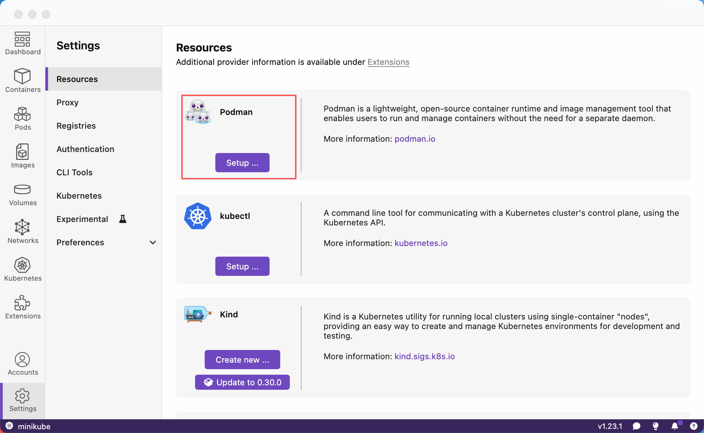

# Podman入门文档

## 一、Podman 是什么？

[**Podman**](https://podman.io) (Pod Manager)是一款开源的**无守护进程（Daemonless）容器引擎**，由 Red Hat 主导开发。

**核心特性：**

- **无守护进程**：直接调用 OCI 运行时（如 `runc`），无需后台进程，减少安全风险。
- **无根模式（Rootless）**：普通用户可直接运行容器，无需 `sudo`。
- **Docker CLI 兼容**：支持 `docker` 命令别名（如 `alias docker=podman`）。
- **原生 Pod 支持**：可管理多个共享网络和存储的容器组（类似 Kubernetes Pod）。


<br/>


## 二、安装 Podman

### 2.3 Linux

```bash
# CentOS/RHEL
sudo yum install -y podman
podman --version

# Ubuntu 20.04+ / Debian 11+
sudo apt update && sudo apt install -y podman
podman --version
```

### 2.3 MacOS

> [**官网**](https://podman.io/) 提供了两种方式安装podman:

- **Podman Desktop【推荐】** :  桌面管理器，可集中管理**Podman/Compose、Machine、镜像和容器**等。
- **Podman Cli**：即通过**安装器**安装Podman应用 (不提供桌面管理器)。



### 2.3 Windows

- 通过 WSL2 安装（推荐）：在 WSL2 中执行 Linux 对应发行版的安装命令；
- 或通过 Chocolatey：`choco install podman`，并初始化虚拟机。

### 2.4 测试Podman

```shell
$ podman pull quay.io/podman/hello

$ podman run quay.io/podman/hello
!... Hello Podman World ...!

         .--"--.
       / -     - \
      / (O)   (O) \
   ~~~| -=(,Y,)=- |
    .---. /`  \   |~~
 ~/  o  o \~~~~.----. ~~
  | =(X)= |~  / (O (O) \
   ~~~~~~~  ~| =(Y_)=-  |
  ~~~~    ~~~|   U      |~~

Project:   https://github.com/containers/podman
Website:   https://podman.io
Desktop:   https://podman-desktop.io
Documents: https://docs.podman.io
YouTube:   https://youtube.com/@Podman
X/Twitter: @Podman_io
Mastodon:  @Podman_io@fosstodon.org
```


<br/>


## 三、基础操作

### 3.1 镜像管理

```bash
# 拉取镜像（默认从Docker Hub）
podman pull docker.io/library/nginx:latest
podman pull alpine:3.18

# 查看本地镜像
podman images

# 删除镜像
podman rmi nginx:latest
```

### 3.2 容器生命周期

```bash
# 运行容器（后台运行，映射端口 8080:80）
podman run -d -p 8080:80 --name mynginx nginx

# 查看运行中容器
podman ps

# 查看所有容器（包括已停止）
podman ps -a

# 停止容器
podman stop mynginx

# 删除容器
podman rm mynginx

# 查看日志
podman logs mynginx
```

### 3.3 Pod 管理(K8s风格)

> Podman 原生支持 Pod，可将多个容器组合成一个 Pod 管理

```bash
# 创建Pod并映射端口
podman pod create --name mypod -p 8080:80

# 在 Pod 中运行容器
podman run -d --pod mypod nginx
podman run -d --pod mypod redis

podman pod ls			    # 查看 Pod 状态
podman pod inspect mypod    # 查看 Pod 详情

podman pod stop mypod   	# 停止 Pod（含所有容器）

podman pod rm mypod     	# 删除 Pod（需先停止）
podman pod rm -f mypod  	# 强制删除 Pod
```

### 3.4 构建自定义镜像

- 创建 `Containerfile`（或 `Dockerfile`）：

```dockerfile
FROM nginx:latest
COPY index.html /usr/share/nginx/html/
```

- 构建并运行：

```bash
podman build -t my-nginx -f Containerfile .
podman run -d -p 8080:80 my-nginx
```


<br/>


## 四、关键配置

### 4.1 无根模式

```bash
# 检查系统支持
podman info --debug | grep user

# 为用户分配子 UID/GID（需 root 权限）
sudo usermod --add-subuids 100000-165535 --add-subgids 100000-165535 $USER
```

### 4.2 镜像加速

编辑 `/etc/containers/registries.conf`（系统级）或 `~/.config/containers/registries.conf`（用户级）：

```toml
[registries.search]
registries = ['docker.io', 'quay.io']

# 添加阿里云加速器（示例）
[[registry]]
prefix = "docker.io"
location = "https://<你的加速器ID>.mirror.aliyuncs.com"
```


<br/>


## 五、总结

Podman 以**无守护进程**和**无根运行**为核心优势，适合安全要求高的场景。通过兼容 Docker CLI 和原生 Pod 支持，可快速替代 Docker 或集成到 Kubernetes 工作流。下一步建议：

- 尝试使用 `podman-compose` 管理多容器应用。
- 探索 `Buildah`（Podman 生态中的镜像构建工具）。